# 3월 20일 — 회귀분석의 기본 개념
## 서베이 문항 설계, 실험 디자인, 그리고 회귀분석을 "진짜로" 이해한다는 것

> <strong>SOC4013-01 고급데이터분석 Ⅱ(캡스톤디자인)</strong> | 2026년 봄학기 3주차
>
> 인터랙티브 프레젠테이션: https://minvv23.github.io/sogang-soc-advanced-data-analysis-ii/20260320-presentation.html

---

## 1. "평균은 회귀분석의 univariate special case다"는 무슨 뜻일까?

### 평균이란 무엇인가: 미분으로 보기

우리가 어렸을 때부터 배운 평균 공식은 이것이다.

$$\bar{Y} = \frac{1}{n} \sum_{i=1}^{n} Y_i$$

그런데 이 공식은 어디서 온 걸까? "다 더해서 n으로 나눈다"는 그냥 정의(definition)처럼 보이지만, 사실 이것은 <strong>최적화 문제의 해(solution)</strong>다.

<strong>문제 설정</strong>: 모든 관측치와의 거리 제곱합을 최소화하는 값 $c$를 찾아라.

$$\min_{c} \sum_{i=1}^{n} (Y_i - c)^2$$

<strong>Step 1</strong>: 목적 함수를 $c$에 대해 전개한다.

$$f(c) = \sum_{i=1}^{n} (Y_i - c)^2 = \sum_{i=1}^{n} (Y_i^2 - 2Y_i c + c^2)$$

<strong>Step 2</strong>: $c$에 대해 미분한다.

$$\frac{df}{dc} = \sum_{i=1}^{n} (-2Y_i + 2c) = -2\sum_{i=1}^{n} Y_i + 2nc$$

<strong>Step 3</strong>: 미분값을 0으로 놓고 $c$에 대해 푼다.

$$-2\sum_{i=1}^{n} Y_i + 2nc = 0$$

$$2nc = 2\sum_{i=1}^{n} Y_i$$

$$c^{\ast} = \frac{1}{n}\sum_{i=1}^{n} Y_i = \bar{Y}$$

<strong>결론: 평균은 "관측치들과의 제곱 거리를 최소화하는 값"이다.</strong> 우리가 당연하게 쓰던 평균 공식이 사실은 최소화 문제의 해였다는 것. 이제 이 논리를 그대로 회귀분석으로 확장해보자.

### 잠깐—모집단, 표본, 그리고 "추정"이란 무엇인가

회귀분석으로 넘어가기 전에, 통계학에서 가장 기본적이면서도 가장 자주 혼동되는 구분을 짚고 가자.

- <strong>모집단(population)</strong>: 우리가 진짜 알고 싶은 전체 대상. "한국 10대 청소년 전체"가 모집단이다. 모집단의 특성(평균, 비율, 회귀 계수 등)을 <strong>모수(parameter)</strong>라 하고, 그리스 문자($\mu$, $\beta$, $\sigma$ 등)로 표기한다
- <strong>표본(sample)</strong>: 모집단에서 뽑아온 일부. 설문에 응답한 1,070명이 표본이다. 표본에서 계산한 값을 <strong>통계량(statistic)</strong> 또는 <strong>추정치(estimate)</strong>라 하고, 로마 문자나 hat(^) 기호($\bar{Y}$, $\hat{\beta}$, $s$ 등)로 표기한다
- <strong>추정(estimation)</strong>: 표본의 데이터로부터 모수의 값을 "추측"하는 행위. 표본 평균 $\bar{Y}$로 모평균 $\mu$를 추정하고, OLS 추정치 $\hat{\beta}_1$으로 진짜 효과 $\beta_1$을 추정한다

| | 모집단 (알 수 없음) | 표본 (관측 가능) |
|--|--|--|
| <strong>표기</strong> | 그리스 문자: $\beta_0$, $\beta_1$, $\sigma^2$ | 로마 문자 / hat: $\hat{\beta}_0$, $\hat{\beta}_1$, $s^2$ |
| <strong>성격</strong> | 고정된 참값 (하나의 숫자) | 표본마다 달라지는 추정치 |
| <strong>예시</strong> | "한국 10대 전체에서 성별 효과는 $\beta_1 = 8.5\%p$" | "1,070명 표본에서 추정한 성별 효과는 $\hat{\beta}_1 = 9.8\%p$" |

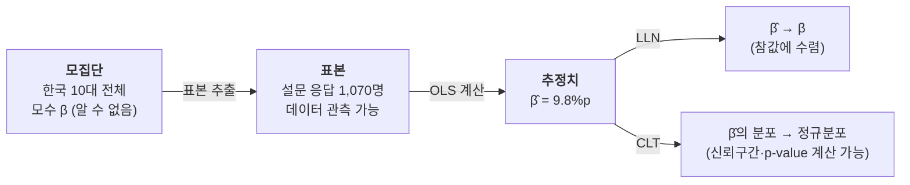
```mermaid
flowchart LR
    A["<b>모집단</b><br/>한국 10대 전체<br/>모수 β (알 수 없음)"] -->|표본 추출| B["<b>표본</b><br/>설문 응답 1,070명<br/>데이터 관측 가능"]
    B -->|OLS 계산| C["<b>추정치</b><br/>β̂ = 9.8%p"]
    C -->|LLN| D["β̂ → β<br/>(참값에 수렴)"]
    C -->|CLT| E["β̂의 분포 → 정규분포<br/>(신뢰구간·p-value 계산 가능)"]
```

통계학의 핵심 과제는 항상 같다: <strong>표본에서 계산한 $\hat{\beta}$가 모집단의 $\beta$에 얼마나 가까운가?</strong> 이 질문에 답하는 것이 대수의 법칙(가까워진다는 보장)과 중심 극한 정리(얼마나 가까운지 계산하는 도구)이며, 뒤에서 자세히 다룬다.

### 통계 교과서의 그리스 문자(β)와 알파벳(b)의 차이

교과서에 따라 회귀 계수를 다르게 표기하는 경우가 있어 혼란스러울 수 있다. 정리하면:

| 표기 | 의미 | 예시 |
|------|------|------|
| $\beta_0$, $\beta_1$ | <strong>모수</strong>: 모집단에서의 진짜 효과. 우리가 알고 싶지만 직접 관측할 수 없다 | "한국 10대 전체에서 성별의 진짜 효과" |
| $\hat{\beta}_0$, $\hat{\beta}_1$ (또는 $b_0$, $b_1$) | <strong>추정치</strong>: 표본 데이터로부터 OLS로 계산한 값. 모수의 "추정" | "1,070명 표본에서 구한 성별 효과 추정치" |

일부 교과서(특히 심리학·사회학 전통)는 추정치를 $b_0$, $b_1$으로 쓰고, 계량경제학 전통에서는 $\hat{\beta}_0$, $\hat{\beta}_1$으로 쓴다. 의미는 동일하다. 이 수업에서는 $\hat{\beta}$ (beta-hat) 표기를 사용한다.

### OLS 계수는 어떻게 도출되는가: 같은 방식으로

이제 독립변수 $X$가 하나 있는 단순회귀(simple regression)를 생각하자.

$$Y_i = \beta_0 + \beta_1 X_i + \epsilon_i$$

여기서 $\epsilon_i$는 <strong>오차(error)</strong>다. 이 시점에서 오차와 잔차의 차이를 명확히 해두자.

### 오차($\epsilon$)와 잔차($e$)는 다르다

| | 오차 (error), $\epsilon_i$ | 잔차 (residual), $e_i$ 또는 $\hat{\epsilon}_i$ |
|--|--|--|
| <strong>정의</strong> | $\epsilon_i = Y_i - \beta_0 - \beta_1 X_i$ | $e_i = Y_i - \hat{\beta}_0 - \hat{\beta}_1 X_i$ |
| <strong>사용하는 계수</strong> | 모수 $\beta$ (모집단의 진짜 값) | 추정치 $\hat{\beta}$ (표본에서 계산한 값) |
| <strong>관측 가능 여부</strong> | 관측 불가 (모수를 모르니까) | 관측 가능 (추정치는 계산했으니까) |
| <strong>성격</strong> | 모형이 포착하지 못하는 진짜 불확실성 | 추정된 모형이 설명하지 못한 나머지 |

직관적으로: 오차 $\epsilon_i$는 "모집단의 진짜 직선(우리는 절대 볼 수 없는)에서 $i$번째 점까지의 거리"이고, 잔차 $e_i$는 "우리가 데이터로 그은 추정 직선에서 $i$번째 점까지의 거리"다. 모수 $\beta$를 모르기 때문에 오차는 절대 직접 볼 수 없고, 우리가 실제로 계산하고 분석하는 것은 항상 잔차다. 잔차 분석(residual analysis)이라고 부르는 이유가 여기에 있다.

이 구분은 앞서 다룬 그리스 문자/로마 문자 구분의 연장선이다. $\beta$와 $\hat{\beta}$가 모수와 추정치인 것처럼, $\epsilon$과 $e$는 오차와 잔차다.

OLS는 잔차 제곱합을 최소화하는 $\beta_0$, $\beta_1$을 찾는다.

$$\min_{\beta_0, \beta_1} \sum_{i=1}^{n} (Y_i - \beta_0 - \beta_1 X_i)^2$$

<strong>Step 1</strong>: 목적 함수를 $S(\beta_0, \beta_1)$이라 놓자.

$$S(\beta_0, \beta_1) = \sum_{i=1}^{n} (Y_i - \beta_0 - \beta_1 X_i)^2$$

<strong>Step 2</strong>: $\beta_0$에 대해 편미분하고 0으로 놓는다.

$$\frac{\partial S}{\partial \beta_0} = -2\sum_{i=1}^{n}(Y_i - \beta_0 - \beta_1 X_i) = 0$$

$$\sum_{i=1}^{n} Y_i - n\beta_0 - \beta_1 \sum_{i=1}^{n} X_i = 0$$

$$\hat{\beta}_0 = \bar{Y} - \hat{\beta}_1 \bar{X} \quad \cdots\text{(1차 조건 ①)}$$

<strong>Step 3</strong>: $\beta_1$에 대해 편미분하고 0으로 놓는다.

$$\frac{\partial S}{\partial \beta_1} = -2\sum_{i=1}^{n} X_i(Y_i - \beta_0 - \beta_1 X_i) = 0$$

$$\sum_{i=1}^{n} X_i Y_i - \beta_0 \sum_{i=1}^{n} X_i - \beta_1 \sum_{i=1}^{n} X_i^2 = 0 \quad \cdots\text{(1차 조건 ②)}$$

<strong>Step 4</strong>: 1차 조건 ①을 ②에 대입해서 $\hat{\beta}_1$을 구한다.

1차 조건 ①에서 $\hat{\beta}_0 = \bar{Y} - \hat{\beta}_1\bar{X}$이므로, 이를 ②에 대입:

$$\sum_{i=1}^{n} X_i Y_i - (\bar{Y} - \hat{\beta}_1\bar{X})\sum_{i=1}^{n} X_i - \hat{\beta}_1\sum_{i=1}^{n} X_i^2 = 0$$

$$\sum_{i=1}^{n} X_i Y_i - \bar{Y}\sum_{i=1}^{n} X_i + \hat{\beta}_1\bar{X}\sum_{i=1}^{n} X_i - \hat{\beta}_1\sum_{i=1}^{n} X_i^2 = 0$$

$\sum_{i=1}^{n} X_i = n\bar{X}$임을 이용하면:

$$\sum_{i=1}^{n} X_i Y_i - n\bar{X}\bar{Y} + \hat{\beta}_1(n\bar{X}^2 - \sum_{i=1}^{n} X_i^2) = 0$$

$$\hat{\beta}_1 = \frac{\sum_{i=1}^{n} X_i Y_i - n\bar{X}\bar{Y}}{\sum_{i=1}^{n} X_i^2 - n\bar{X}^2}$$

분자와 분모를 정리하면:

$$\hat{\beta}_1 = \frac{\sum_{i=1}^{n}(X_i - \bar{X})(Y_i - \bar{Y})}{\sum_{i=1}^{n}(X_i - \bar{X})^2} = \frac{\text{Cov}(X, Y)}{\text{Var}(X)}$$

$$\hat{\beta}_0 = \bar{Y} - \hat{\beta}_1 \bar{X}$$

### $\text{Cov}(X, Y)$는 무엇을 말해주는가

위 결과에서 $\hat{\beta}_1 = \frac{\text{Cov}(X, Y)}{\text{Var}(X)}$라는 깔끔한 공식이 나왔다. 분모인 $\text{Var}(X)$는 $X$의 흩어짐 정도이고, 분자인 $\text{Cov}(X, Y)$가 핵심이다.

$$\text{Cov}(X, Y) = \frac{1}{n-1}\sum_{i=1}^{n}(X_i - \bar{X})(Y_i - \bar{Y})$$

공분산(covariance)은 <strong>"X가 평균보다 높을 때, Y도 평균보다 높은 경향이 있는가?"</strong>를 측정한다.

- $(X_i - \bar{X})$: $i$번째 사람의 $X$가 평균보다 높은가 낮은가
- $(Y_i - \bar{Y})$: $i$번째 사람의 $Y$가 평균보다 높은가 낮은가
- 둘의 곱: 같은 방향이면 양수, 반대 방향이면 음수

<strong>서베이 예시</strong>: 소득($X$)과 정치 관심도($Y$)의 공분산이 양수라는 것은, "소득이 평균보다 높은 사람이 정치 관심도도 평균보다 높은 경향이 있다"는 뜻이다. 즉, 소득과 정치 관심도가 <strong>같은 방향으로 함께 움직인다</strong>.

공분산 자체는 $X$와 $Y$의 단위에 따라 크기가 달라지므로 해석이 어렵다. 이것을 각각의 표준편차로 나누어 $[-1, 1]$ 범위로 표준화한 것이 <strong>상관계수(correlation coefficient)</strong> $r = \frac{\text{Cov}(X,Y)}{s_X \cdot s_Y}$이다. 회귀 계수는 이 공분산을 $X$의 분산만으로 나눈 것이므로, "상관관계의 방향"은 유지하되 "$X$ 한 단위당 $Y$의 변화"라는 해석 가능한 단위를 갖게 된다.

### 독립변수가 없으면? → 평균이 된다

위 결과에서 독립변수 $X$를 아예 빼버리면 ($k = 0$), 모형은 $Y_i = \beta_0 + \epsilon_i$가 된다. 최소화 문제는:

$$\min_{\beta_0} \sum_{i=1}^{n}(Y_i - \beta_0)^2$$

이것은 맨 처음 평균을 도출할 때와 <strong>정확히 같은 문제</strong>다. 따라서:

$$\hat{\beta}_0 = \bar{Y}$$

<strong>평균을 구하는 것과 독립변수 없는 회귀분석을 돌리는 것은 수학적으로 동일한 연산이다.</strong> 같은 최소화 원리(제곱 거리 최소화)에서 출발해서, 독립변수가 없으면 평균이 나오고, 독립변수를 넣으면 회귀 계수가 나온다. 평균은 회귀의 가장 단순한 특수 경우(univariate special case)다.

### 이게 왜 중요한가

이 사실이 단순한 수학적 트릭이 아닌 이유는, <strong>평균에 대해 우리가 아는 모든 직관이 회귀분석으로 그대로 확장되기 때문</strong>이다.

- <strong>평균은 "대표값"이다</strong> → 회귀 계수도 "대표적 관계"를 나타낸다
- <strong>평균은 관측치가 많을수록 안정적이다</strong> → 회귀 계수도 표본이 클수록 안정적이다 (대수의 법칙)
- <strong>평균 주위로 관측치들이 흩어져 있다</strong> → 회귀선 주위로 관측치들이 흩어져 있다 (오차의 분산)
- <strong>표본 평균의 분포는 정규분포에 수렴한다</strong> → 회귀 계수의 분포도 정규분포에 수렴한다 (중심 극한 정리). "분포가 수렴한다"는 말이 처음에는 낯설 수 있다. 이것이 의미하는 것은: 만약 같은 설문을 다른 1,070명에게 반복해서 돌릴 수 있다면, 매번 다른 $\hat{\beta}_1$이 나올 것이다. 이 $\hat{\beta}_1$들을 모아서 히스토그램을 그리면 종 모양(정규분포)이 된다는 뜻이다. 실제로 설문을 반복할 수는 없지만, 이 수학적 보장 덕분에 우리는 단 한 번의 표본에서 신뢰구간과 p-value를 계산할 수 있다. 이것은 뒤에서 더 자세히 다룬다

### 서베이 예시

10대 청소년 1,070명에게 "현재 한국 사회의 성평등 수준은 어느 정도라고 생각하십니까?"라는 질문을 0(매우 불평등)~10(완전 평등) 척도로 물었다고 하자.

- <strong>독립변수 없이</strong> 평균만 구하면: $\bar{Y} = 4.8$ → 이것은 $Y_i = \beta_0 + \epsilon_i$에서 $\hat{\beta}_0 = 4.8$과 동일
- <strong>성별($X_1$)을 넣으면</strong>: $Y_i = \beta_0 + \beta_1 \cdot \text{Sex}_i + \epsilon_i$ (남성=1, 여성=0) → $\hat{\beta}_0$는 여성의 평균 응답, $\hat{\beta}_0 + \hat{\beta}_1$은 남성의 평균 응답

평균 → 집단별 평균 → 여러 변수를 통제한 조건부 평균. 이 흐름이 회귀분석의 본질이다.

---

## 2. 변수의 유형과 더미 변수

### 변수의 두 가지 유형

| 유형 | 정의 | 예시 | 회귀분석에서의 처리 |
|------|------|------|------------------|
| <strong>연속형 (numeric/continuous)</strong> | 숫자 자체에 의미가 있고, 크기 비교·사칙연산이 가능 | 소득(만 원), 나이(세), 정치관심도(0~10) | 그냥 넣으면 된다 |
| <strong>범주형 (categorical)</strong> | 숫자가 아닌 범주/그룹을 나타냄 | 성별(남/여), 지역(서울/경기/...), 학력(고졸/대졸/...) | <strong>더미 변수로 변환</strong>해야 한다 |

### 더미 변수(dummy variable)란

범주형 변수를 회귀분석에 넣으려면 0과 1로 된 더미 변수로 바꿔야 한다.

예: 성별 (남=1, 여=0)

$$\text{Sex}_i = \begin{cases} 1 & \text{if } i\text{번째 응답자가 남성} \\ 0 & \text{if } i\text{번째 응답자가 여성} \end{cases}$$

$$Y_i = \beta_0 + \beta_1 \cdot \text{Sex}_i + \epsilon_i$$

- $\text{Sex}_i = 0$ (여성): $\hat{Y}_i = \hat{\beta}_0$ → <strong>여성의 평균 $Y$</strong> (기준 집단)
- $\text{Sex}_i = 1$ (남성): $\hat{Y}_i = \hat{\beta}_0 + \hat{\beta}_1$ → <strong>남성의 평균 $Y$</strong>
- $\hat{\beta}_1$ = 남성 평균 - 여성 평균 = <strong>두 집단 간 평균 차이</strong>

이 $\hat{\beta}_1$에 대한 t-test는 <strong>독립표본 t-검정(two-sample t-test)</strong>과 수학적으로 동일하다. 이것이 다시 "평균은 회귀의 special case"라는 주장을 뒷받침한다. t-test, ANOVA, 상관분석—학부 통계에서 배우는 이 기법들은 전부 회귀분석의 특수한 경우다.

### 범주가 3개 이상일 때: 왜 하나를 빼야 하는가

지역 변수: 서울, 경기, 그 외

더미 변수를 3개 만들 수 있다.

$$\text{서울}_i = \begin{cases} 1 & \text{서울} \\ 0 & \text{아님} \end{cases}, \qquad \text{경기}_i = \begin{cases} 1 & \text{경기} \\ 0 & \text{아님} \end{cases}, \qquad \text{그외}_i = \begin{cases} 1 & \text{그 외} \\ 0 & \text{아님} \end{cases}$$

그런데 이 세 변수를 다 넣으면 문제가 생긴다.

$$\text{서울}_i + \text{경기}_i + \text{그외}_i = 1 \quad \text{(모든 }i\text{에 대해 항상)}$$

이 세 변수의 합이 항상 1이라는 것은, 이 중 하나가 나머지 둘의 선형결합으로 완벽하게 표현된다는 뜻이다: $\text{그외}_i = 1 - \text{서울}_i - \text{경기}_i$. 이것을 <strong>완전 다중공선성(perfect multicollinearity)</strong>이라 하며, 이 상태에서는 OLS가 유일한 해를 가질 수 없다 — $(X'X)$ 행렬이 singular가 되어 역행렬이 존재하지 않는다.

해결법: <strong>하나를 빼고 기준 범주(base/reference category)로 삼는다.</strong>

$$Y_i = \beta_0 + \beta_1 \cdot \text{서울}_i + \beta_2 \cdot \text{경기}_i + \epsilon_i$$

- "그 외"가 기준 범주 (base category)
- $\hat{\beta}_0$ = "그 외" 지역의 평균 $Y$
- $\hat{\beta}_1$ = 서울 평균 - "그 외" 평균 (서울과 기준 범주의 차이)
- $\hat{\beta}_2$ = 경기 평균 - "그 외" 평균 (경기와 기준 범주의 차이)

<strong>모든 계수는 기준 범주와의 비교로 해석된다.</strong> 기준 범주를 바꾸면 계수의 값은 달라지지만, 모형의 예측값과 전체적인 통계적 유의성($F$-test 등)은 동일하다. 어떤 범주를 기준으로 삼을지는 분석자가 결정한다—보통 가장 큰 집단이나, 이론적으로 "비교 기준"이 되는 집단을 선택한다.

### 서베이 예시

10대 청소년 설문에서 "고교 유형"이 범주형 변수라면:

| 고교 유형 | 더미 변수 |
|----------|----------|
| 일반고 (base) | — (빠짐) |
| 자사고/특목고 | $\text{특목고}_i$ |
| 대안학교 | $\text{대안}_i$ |

$$\text{부정선거론}_i = \beta_0 + \beta_1 \cdot \text{특목고}_i + \beta_2 \cdot \text{대안}_i + \epsilon_i$$

- $\hat{\beta}_0 = 45\%$: 일반고 학생의 평균 부정선거론 수용률
- $\hat{\beta}_1 = -8\%p$: 특목고 학생은 일반고 대비 8%p 낮다
- $\hat{\beta}_2 = -12\%p$: 대안학교 학생은 일반고 대비 12%p 낮다

---

## 3. "다른 변수를 통제했을 때의 조건부 평균 차이" (Ceteris Paribus)

### 회귀 계수의 진짜 의미

다중회귀(multiple regression)에서 $\hat{\beta}_1$의 의미는 <strong>"다른 모든 변수를 일정하게 고정했을 때(ceteris paribus), $X_1$이 한 단위 변할 때 $Y$의 평균적 변화"</strong>다.

$$Y_i = \beta_0 + \beta_1 X_{1i} + \beta_2 X_{2i} + \cdots + \beta_k X_{ki} + \epsilon_i$$

여기서 $\beta_1 = \frac{\partial E[Y|X_1, X_2, \ldots, X_k]}{\partial X_1}$이다. $X_2, \ldots, X_k$를 고정한 채 $X_1$만 변할 때의 효과.

### 시각적으로 이해하기: 통제변수가 하는 일

"성별이 부정선거론 수용에 미치는 효과"를 추정한다고 하자.

<strong>모형 1 — 통제변수 없음</strong>:

$$\text{부정선거론}_i = \beta_0 + \beta_1 \cdot \text{Sex}_i + \epsilon_i$$

이 모형에서 $\hat{\beta}_1$은 단순히 "남성 평균 - 여성 평균"이다.

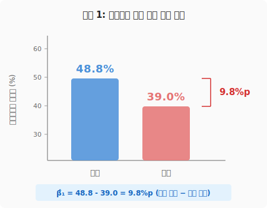

그런데 문제가 있다. 남학생과 여학생은 소득, 지역, 뉴스 소비량 등 <strong>다른 특성에서도 다를 수 있다</strong>. 만약 남학생이 유독 저소득 가구에 많고, 저소득 가구가 부정선거론을 더 많이 수용한다면? 이때 9.8%p의 차이 중 일부는 성별 자체의 효과가 아니라 소득의 효과가 성별을 "타고" 나타난 것일 수 있다.

<strong>모형 2 — 소득 통제</strong>:

$$\text{부정선거론}_i = \beta_0 + \beta_1 \cdot \text{Sex}_i + \beta_2 \cdot \text{소득}_i + \epsilon_i$$

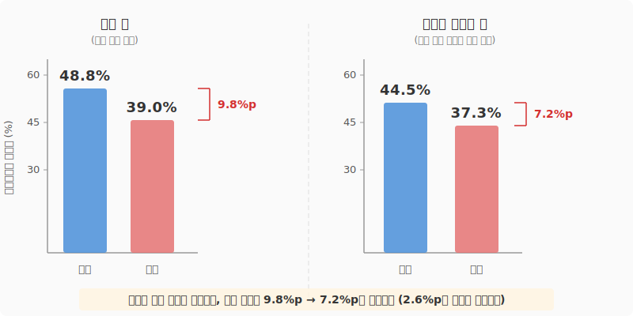

통제변수를 넣는다는 것은 <strong>"같은 조건의 사람들끼리 비교한다"</strong>는 뜻이다. 소득을 통제하면 "같은 소득 수준의 남녀"를 비교하게 되고, 소득 때문에 생긴 차이는 제거된다. 남는 것이 성별 "자체"의 효과에 더 가까운 추정치다.

### 통제변수는 언제 넣어야 하는가

통제변수의 목적은 <strong>$X$와 $Y$ 모두에 영향을 미치는 제3의 변수(교란 변수, confounder)를 차단하는 것</strong>이다.

넣어야 하는 경우:
- $Z$가 $X$에도 영향을 미치고, $Y$에도 영향을 미칠 때 (교란 변수)
- 예: 성별 → 부정선거론에서 "소득"은 교란 변수일 수 있다 (소득이 성별과도 상관, 정치 태도와도 상관)

넣으면 <strong>안 되는</strong> 경우는 뒤의 "bad control" 섹션에서 다룬다.

### 핵심 정리

| 개념 | 의미 |
|------|------|
| $\hat{\beta}_1$ (단순회귀) | $X$와 $Y$의 <strong>무조건적</strong> 평균 관계 |
| $\hat{\beta}_1$ (다중회귀) | 다른 변수를 통제한 후의 <strong>조건부</strong> 평균 관계 |
| 통제변수 | "같은 조건의 사람들끼리 비교"를 가능하게 하는 변수 |
| Ceteris paribus | "다른 모든 것이 같을 때" — 다중회귀 계수의 해석 전제 |

### 통제변수를 하나 더 넣었더니 결과가 뒤집히는 경우

가끔 이런 일이 생긴다: 모형 1에서 $X_1$의 효과가 유의하지 않았는데, 통제변수 $Z$를 하나 추가한 모형 2에서 갑자기 유의해진다. 왜 이런 일이 생기는 걸까?

<strong>예시로 보자.</strong> "SNS 사용시간($X_1$)이 부정선거론 수용($Y$)에 미치는 효과"를 추정한다.

<strong>모형 1 — 통제변수 없음</strong>:

$$Y_i = \beta_0 + \beta_1 \cdot \text{SNS시간}_i + \epsilon_i$$

결과: $\hat{\beta}_1 = 0.8$, $p = 0.35$ (유의하지 않음)

<strong>모형 2 — 나이를 통제</strong>:

$$Y_i = \beta_0 + \beta_1 \cdot \text{SNS시간}_i + \beta_2 \cdot \text{나이}_i + \epsilon_i$$

결과: $\hat{\beta}_1 = 3.2$, $p = 0.01$ (유의함!)

어떻게 된 걸까? 이것을 이해하려면 <strong>누락 변수 편향(omitted variable bias)</strong>의 공식을 봐야 한다.

$$\text{plim}\ \hat{\beta}_1^{\text{short}} = \beta_1 + \beta_2 \cdot \delta$$

여기서:
- $\hat{\beta}_1^{\text{short}}$: 통제변수를 빠뜨린 "짧은" 모형의 계수 추정치
- $\beta_1$: $X_1$의 진짜 효과
- $\beta_2$: 빠뜨린 변수 $Z$의 효과
- $\delta$: $X_1$을 $Z$로 회귀했을 때의 계수 (= $X_1$과 $Z$의 상관 방향)

핵심은 <strong>$\beta_2 \cdot \delta$가 편향의 방향과 크기를 결정</strong>한다는 것이다.

| | $\delta > 0$ ($X_1$과 $Z$가 양의 상관) | $\delta < 0$ ($X_1$과 $Z$가 음의 상관) |
|--|--|--|
| $\beta_2 > 0$ ($Z$가 $Y$를 높임) | 편향 <strong>양(+)</strong>: 과대추정 | 편향 <strong>음(-)</strong>: 과소추정 |
| $\beta_2 < 0$ ($Z$가 $Y$를 낮춤) | 편향 <strong>음(-)</strong>: 과소추정 | 편향 <strong>양(+)</strong>: 과대추정 |

<strong>위 예시에 적용하면:</strong>

- 나이가 많을수록 SNS를 덜 한다 → $\delta < 0$ (나이와 SNS시간은 음의 상관)
- 나이가 많을수록 부정선거론을 더 수용한다 → $\beta_2 > 0$
- 따라서 편향 = $\beta_2 \times \delta = (+) \times (-) = (-)$, 즉 <strong>진짜 효과보다 과소추정</strong>

진짜 효과($\beta_1 = 3.2$)가 분명히 존재하는데, 나이를 빠뜨리면 음의 편향이 섞여 들어와서 $\hat{\beta}_1 = 0.8$로 쪼그라든 것이다. 나이를 통제하면 이 편향이 제거되어 진짜 효과가 드러난다.

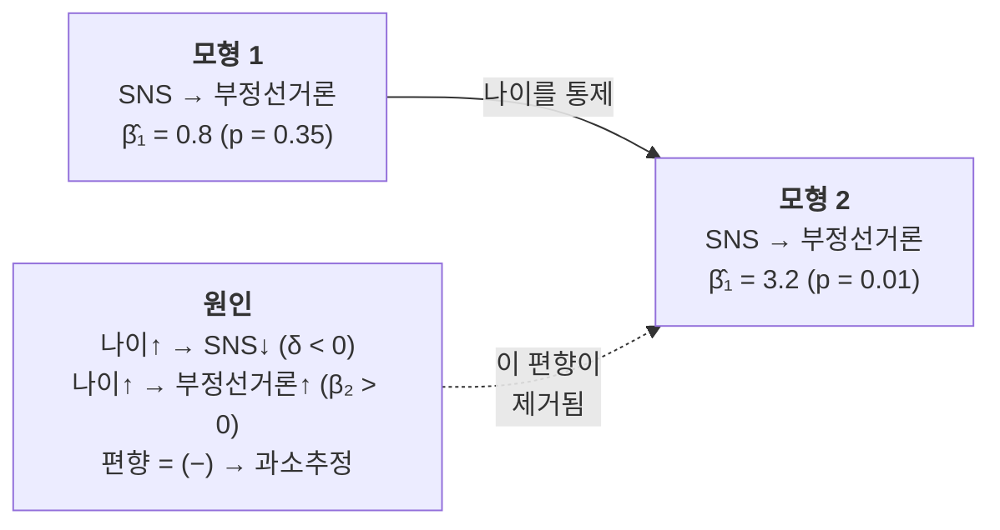
```mermaid
flowchart LR
    A["<b>모형 1</b><br/>SNS → 부정선거론<br/>β̂₁ = 0.8 (p = 0.35)"] -->|"나이를 통제"| B["<b>모형 2</b><br/>SNS → 부정선거론<br/>β̂₁ = 3.2 (p = 0.01)"]
    C["<b>원인</b><br/>나이↑ → SNS↓ (δ < 0)<br/>나이↑ → 부정선거론↑ (β₂ > 0)<br/>편향 = (−) → 과소추정"] -.->|"이 편향이<br/>제거됨"| B
```

<strong>이것을 억압(suppression)이라 부른다.</strong> 빠뜨린 변수가 $X_1$의 진짜 효과를 "억눌러서" 안 보이게 만든 것이다. 정확히는 누락 변수 편향이 진짜 효과와 <strong>반대 방향</strong>으로 작용해서, 결과적으로 효과가 0 근처로 끌려간 경우다.

<strong>반대 상황도 가능하다</strong>: 통제변수를 넣었더니 유의하던 것이 유의하지 않게 되는 경우. 이것은 편향이 진짜 효과와 <strong>같은 방향</strong>으로 작용해서 효과를 과대추정하고 있었던 것이다. 교란 변수를 통제하면 부풀려진 효과가 제자리로 돌아간다.

<strong>핵심</strong>: 통제변수를 추가했을 때 계수가 바뀌는 것은 "모형이 불안정하다"는 뜻이 아니라, <strong>빠뜨린 변수가 편향을 만들고 있었다는 증거</strong>다. 어떤 방향으로 바뀌든, 올바른 통제변수를 넣은 모형이 더 정확한 추정치를 준다.

---

## 4. "추정(estimation)이 곧 예측(prediction)과도 같다"는 무슨 뜻일까?

### 추정과 예측: 같은 수식, 다른 질문

회귀분석으로 계수를 추정하면 다음과 같은 식이 나온다.

$$\hat{Y}_i = \hat{\beta}_0 + \hat{\beta}_1 X_{1i} + \hat{\beta}_2 X_{2i} + \cdots + \hat{\beta}_k X_{ki}$$

이 식을 산점도 위에 그려보면 회귀분석이 하는 일이 한눈에 보인다.

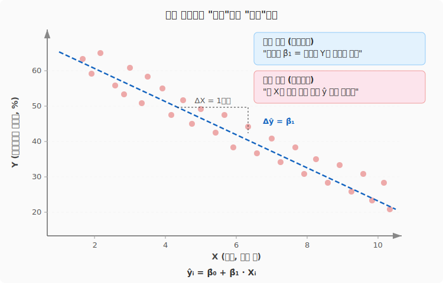

같은 직선($\hat{Y} = \hat{\beta}_0 + \hat{\beta}_1 X$)이 두 가지 역할을 동시에 한다.

| | 추정 (Estimation) | 예측 (Prediction) |
|--|--|--|
| <strong>질문</strong> | "기울기 $\hat{\beta}_1$이 얼마인가?" | "새로운 $X$ 값에 대해 $\hat{Y}$는 얼마인가?" |
| <strong>관심 대상</strong> | $\hat{\beta}_1$의 값과 부호, 통계적 유의성 | $\hat{Y}_{\text{new}}$의 정확도 |
| <strong>주요 분야</strong> | 사회과학, 계량경제학 | 머신러닝, 예측 모델링 |
| <strong>직선에서 읽는 것</strong> | <strong>기울기</strong> (한 단위 변화의 효과) | <strong>직선 위의 좌표</strong> ($X$를 넣었을 때 $Y$ 값) |

그런데 수학적으로 이 둘은 <strong>같은 식의 다른 측면</strong>이다.

### 왜 "같다"고 하는가

$\hat{\beta}_1 = 0.3$이라는 추정치가 있다면, 이것은 동시에 다음을 의미한다.

- <strong>추정</strong>: " $X_1$ 이 한 단위 높은 사람은 $Y$ 가 평균적으로 0.3 높다"
- <strong>예측</strong>: " $X_1$ 이 한 단위 높은 사람의 $Y$ 를 0.3만큼 더 높게 예측한다"

같은 계수가 "효과의 크기"이면서 동시에 "예측의 기울기"다. 추정이 정확하면 예측도 정확하고, 추정이 편향되면 예측도 편향된다.

### 그래서 뭐가 다른가: 사회과학이 택하는 길

차이는 <strong>관심의 초점</strong>에 있다.

- <strong>예측 중심 (머신러닝)</strong>: $\hat{Y}$가 $Y$에 최대한 가까우면 된다. $\hat{\beta}_1$이 해석 가능하든 아니든 상관없다. 변수를 100개 넣든, 변수를 비선형으로 변환하든, 예측 정확도($R^2$, RMSE 등)만 높이면 성공이다
- <strong>추정 중심 (사회과학)</strong>: $\hat{\beta}_1$이 진짜 효과($\beta_1$)에 편향 없이 가까운지가 중요하다. $R^2$가 낮아도 상관없다—$\hat{\beta}_1$이 인과적으로 해석 가능하면 된다

사회과학에서 예측 성능이 크게 중요하지 않은 이유는 여기에 있다. 우리의 목표는 "맞추는 것"이 아니라 "이해하는 것"이다. $X$가 $Y$에 미치는 효과의 방향, 크기, 통계적 유의성—이것이 사회과학 회귀분석의 핵심이다.

### 서베이 예시

"부모의 소득이 청소년의 정치 관심도에 영향을 미치는가?"를 분석한다고 하자.

- <strong>추정 관점</strong>: $\hat{\beta}_{\text{income}} = 0.15$ (p < 0.05). 부모 소득이 1백만 원 높을수록 정치 관심도가 0.15점 높다. 이 효과가 성별, 지역, 학력을 통제해도 유지되는지가 관건
- <strong>예측 관점</strong>: 특정 청소년의 정치 관심도를 맞추려면, 소득 외에 SNS 사용시간, 뉴스 소비량, 부모 정치성향 등을 다 넣어서 $\hat{Y}$의 오차를 최소화하면 된다

사회과학자에게는 전자가 중요하다. "이 변수가 효과가 있는가?"가 "이 사람의 점수를 맞출 수 있는가?"보다 선행한다.

---

## 5. "모형(model)"이란 무엇인가 — Reduced Form vs. Structural Model

### 사회과학 안에서의 또 다른 갈라짐

앞 섹션에서 "추정 중심(사회과학) vs. 예측 중심(머신러닝)"의 차이를 다뤘다. 그런데 추정 중심의 사회과학 <strong>내부</strong>에도 깊은 철학적 갈라짐이 있다. 같은 데이터를 보면서도 접근 방식이 완전히 다른 두 진영이다.

| | Reduced Form (축약형) | Structural Model (구조적 모형) |
|--|--|--|
| <strong>핵심 질문</strong> | "$X$가 $Y$에 인과적 효과가 있는가?" | "사람들은 <strong>왜</strong> 그런 행동을 하는가?" |
| <strong>방법</strong> | 회귀분석, 자연실험, 도구변수, 이중차분법 등으로 인과 효과를 <strong>식별(identification)</strong> | 인간 행위의 의사결정 모형을 세우고, 그 모형의 모수를 데이터로 <strong>추정</strong> |
| <strong>가정의 성격</strong> | 최소한의 통계적 가정 (외생성, 배제 제약 등) | 행위에 대한 명시적 이론 (효용 극대화, 합리적 기대 등) |
| <strong>장점</strong> | 내적 타당성이 높다 (인과 효과를 깔끔하게 식별) | 반사실적 시나리오(counterfactual)를 시뮬레이션 가능 |
| <strong>한계</strong> | "왜 그런 효과가 나오는지"는 설명하지 못한다 | 모형의 가정이 틀리면 결론 전체가 무너진다 |
| <strong>비유</strong> | "이 약이 효과가 있는가?" (임상시험) | "이 약이 <strong>어떤 메커니즘으로</strong> 작용하는가?" (약리학) |

### 주식 투자로 이해하기

이 차이를 주식 투자 비유로 보면 직관적이다.

<strong>Reduced Form 투자자</strong> — "데이터가 말해준다":

- 과거 데이터를 보니, 특정 기업의 실적 발표 직후 주가가 평균 3% 오른다
- 인과적 전략: "실적 발표 직전에 사서, 직후에 판다"
- <strong>왜</strong> 3% 오르는지는 묻지 않는다. 투자자의 심리든, 알고리즘 거래든, 이유는 상관없다—데이터에서 안정적으로 관찰되는 패턴이 있으면 충분하다
- 핵심: <strong>"이 효과가 존재하는가? 얼마나 큰가?"</strong>

<strong>Structural Model 투자자</strong> — "인간 행동을 모형화한다":

- 투자자를 "정보를 처리하고 효용을 극대화하는 행위자"로 모형화한다
- 모형: 투자자는 기업의 미래 현금흐름을 추정하고, 위험 회피도($\gamma$)에 따라 포트폴리오를 구성한다. 실적 발표는 미래 현금흐름에 대한 기대를 업데이트한다
- 이 모형으로 "만약 공매도가 금지되면 실적 발표 효과가 어떻게 달라지는가?" 같은 <strong>반사실적 질문</strong>에 답할 수 있다 — reduced form 접근으로는 불가능한 질문이다
- 핵심: <strong>"사람들은 왜 이렇게 행동하는가? 조건이 바뀌면 행동이 어떻게 달라지는가?"</strong>

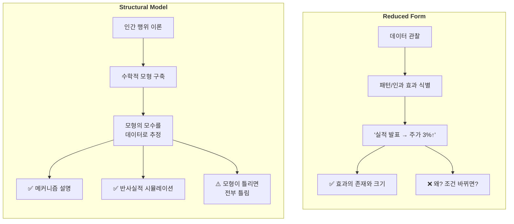
```mermaid
flowchart TB
    subgraph rf ["<b>Reduced Form</b>"]
        direction TB
        R1["데이터 관찰"] --> R2["패턴/인과 효과 식별"]
        R2 --> R3["'실적 발표 → 주가 3%↑'"]
        R3 --> R4["✅ 효과의 존재와 크기"]
        R3 --> R5["❌ 왜? 조건 바뀌면?"]
    end
    subgraph sm ["<b>Structural Model</b>"]
        direction TB
        S1["인간 행위 이론"] --> S2["수학적 모형 구축"]
        S2 --> S3["모형의 모수를<br/>데이터로 추정"]
        S3 --> S4["✅ 메커니즘 설명"]
        S3 --> S5["✅ 반사실적 시뮬레이션"]
        S3 --> S6["⚠️ 모형이 틀리면<br/>전부 틀림"]
    end
```

<strong>어느 쪽이 맞는가?</strong> 둘 다 맞다—질문이 다를 뿐이다. "최저임금 인상이 고용을 줄이는가?"라는 질문에는 reduced form(이중차분법 등)이 적합하다. "최저임금을 15,000원으로 올리면 어떤 산업에서 얼마만큼의 고용 감소가 예상되는가?"라는 질문에는 노동시장의 구조적 모형이 필요하다. 전자는 <strong>과거 정책의 효과를 평가</strong>하고, 후자는 <strong>아직 시행되지 않은 정책의 결과를 예측</strong>한다.

### "저는 모형을 안 씁니다" — 왜 이 주장이 성립하지 않는가

Reduced form을 선호하는 연구자 중 일부가 이렇게 말한다: "저는 구조적 모형 같은 거 안 써요. 그냥 데이터로 인과 효과를 추정할 뿐이에요."

<strong>이것은 근본적으로 틀린 주장이다.</strong> 회귀분석을 돌리는 순간, 당신은 이미 모형을 쓰고 있다.

$$Y_i = \beta_0 + \beta_1 X_{1i} + \beta_2 X_{2i} + \epsilon_i$$

이 식은 <strong>모형(model)</strong>이다. 구체적으로, 이 한 줄의 식은 다음을 <strong>가정</strong>하고 있다:

1. <strong>선형성</strong>: $X$와 $Y$의 관계가 직선이다. 곡선이거나 불연속일 가능성을 배제한다
2. <strong>가산성(additivity)</strong>: $X_1$의 효과와 $X_2$의 효과가 독립적으로 더해진다. 교차효과가 없다고 가정한다 (교차항을 넣지 않는 한)
3. <strong>동질적 효과(homogeneous effects)</strong>: $\beta_1$은 모든 사람에게 동일하다. 남성에게 $\beta_1 = 5$이고 여성에게 $\beta_1 = 2$인 가능성을 무시한다 (교차항을 넣지 않는 한)
4. <strong>함수적 형태(functional form)</strong>: $Y$에 로그를 씌울지, $X$를 제곱할지—이 선택 자체가 모형의 일부다

"모형을 안 쓴다"는 것은 이 가정들을 의식하지 못하고 있다는 뜻이지, 가정이 없다는 뜻이 아니다.

<strong>비유</strong>: "나는 지도 없이 운전한다"고 말하는 사람이 있다고 하자. 실제로는 머릿속에 도로에 대한 모형(mental model)이 있기 때문에 운전할 수 있는 것이다. 그 모형이 부정확하면(도로가 끊긴 곳을 모르면) 사고가 난다. 회귀분석도 마찬가지다—모형을 "안 쓰는" 것이 아니라, 모형의 존재를 인식하지 못하는 것이 위험하다.

### 진짜 차이는 "모형을 쓰느냐 마느냐"가 아니다

| | Reduced Form | Structural Model |
|--|--|--|
| <strong>모형을 쓰는가?</strong> | <strong>쓴다</strong> (회귀 모형) | <strong>쓴다</strong> (행위 모형 + 회귀 모형) |
| <strong>모형의 범위</strong> | 통계적 관계에 대한 모형 | 인간 행동에 대한 이론적 모형 |
| <strong>가정의 출처</strong> | 통계적 가정 (외생성, 선형성 등) | 이론적 가정 (합리성, 효용 극대화 등) + 통계적 가정 |
| <strong>모형이 틀릴 위험</strong> | 상대적으로 낮음 (가정이 적으므로) | 상대적으로 높음 (가정이 많으므로) |

<strong>핵심</strong>: 차이는 "모형 유무"가 아니라 <strong>"얼마나 많은 구조(structure)를 부과하는가"</strong>다. Reduced form은 최소한의 구조만 부과하고("$Y$와 $X$의 관계가 대략 선형이고, 이 변수를 통제하면 외생성이 확보된다"), structural model은 훨씬 풍부한 구조를 부과한다("사람들은 이런 효용 함수를 가지고, 이런 제약 조건 하에서, 이런 방식으로 의사결정한다").

더 많은 구조를 부과할수록 <strong>더 풍부한 질문</strong>에 답할 수 있지만, 그 구조가 <strong>틀릴 위험</strong>도 커진다. 이 trade-off를 이해하는 것이 사회과학 방법론의 핵심이다.

### 이 수업에서의 위치

이 수업에서 다루는 OLS 회귀분석은 reduced form 전통에 속한다. 우리는 인간 행동의 이론적 모형을 세우지 않고, 데이터에서 변수 간의 관계를 추정한다. 하지만 그렇다고 "모형 없이" 작업하는 것이 아니다. $Y = \beta_0 + \beta_1 X + \epsilon$이라는 식을 쓰는 순간, 우리는 이미 세계에 대한 가정을 하고 있고, 그 가정이 맞는지 검토하는 것(선형성, 외생성, 함수적 형태 등)이 이 수업의 핵심 내용이다.

---

## 6. '대수의 법칙'과 '중심 극한 정리'는 어떻게 다르고, 회귀분석에서 우리는 뭘 하고 있는가?

### 대수의 법칙 (Law of Large Numbers, LLN)

> <strong>표본 평균은 표본 크기가 커질수록 모평균에 수렴한다.</strong>

수식으로:

$$\bar{X}_n = \frac{1}{n}\sum_{i=1}^{n} X_i \xrightarrow{p} \mu \quad \text{as} \quad n \to \infty$$

이 수식을 읽는 법:
- $\bar{X}_n$: 표본 크기가 $n$일 때의 표본 평균
- $\xrightarrow{p}$: "확률적으로 수렴한다(converges in probability)". $n$이 커질수록 $\bar{X}_n$이 $\mu$ 근처에 있을 확률이 1에 가까워진다는 뜻이다. 엄밀한 정의는 $P(|\bar{X}_n - \mu| > \epsilon) \to 0$인데, 직관적으로는 "큰 표본에서는 추정치가 참값에서 멀리 벗어날 가능성이 거의 사라진다"는 의미다
- $\text{as}\ n \to \infty$: "표본 크기 $n$이 무한대로 갈 때". 실제로 무한대가 필요한 것은 아니고, $n$이 충분히 크면 성립한다는 뜻

직관적 의미: 동전을 10번 던지면 앞면 비율이 0.3일 수도 0.7일 수도 있지만, 10,000번 던지면 0.5 근처에 "붙는다". <strong>표본이 크면 추정치가 참값에 가까워진다는 보장</strong>이다.

### 중심 극한 정리 (Central Limit Theorem, CLT)

> <strong>표본 평균은 원래 분포가 무엇이든 간에, 표본 크기가 충분하면 정규분포에 근사한다.</strong>

수식으로:

$$\frac{\bar{X}_n - \mu}{\sigma / \sqrt{n}} \xrightarrow{d} N(0, 1) \quad \text{as} \quad n \to \infty$$

이 수식을 읽는 법:
- 좌변: 표본 평균 $\bar{X}_n$에서 모평균 $\mu$를 빼고, 표준오차 $\sigma/\sqrt{n}$으로 나눈 것. 즉 "추정치가 참값에서 표준오차 몇 개 떨어져 있는가"를 표준화한 값
- $\xrightarrow{d}$: "분포가 수렴한다(converges in distribution)". LLN의 $\xrightarrow{p}$(값이 수렴)와 다르다. 여기서는 값 자체가 아니라, 그 값의 <strong>확률 분포 모양</strong>이 특정 분포에 가까워진다는 뜻
- $N(0, 1)$: 평균 0, 분산 1인 표준정규분포

직관적 의미: 원래 데이터가 어떤 모양이든—오른쪽으로 치우쳐 있든, 쌍봉이든, 균등분포든—표본 평균의 분포는 종 모양(정규분포)에 수렴한다. <strong>이것은 개별 데이터의 분포가 아니라 "추정치의 분포"에 대한 정리다.</strong>

### 이것은 평균에만 해당하는 이야기가 아니다

LLN과 CLT는 교과서에서 "표본 평균"을 예시로 설명하지만, 사실 <strong>표본에서 계산하는 거의 모든 추정치</strong>에 동일하게 적용된다.

| 추정 대상 | 추정치 | LLN (큰 표본에서 참값에 수렴) | CLT (추정치 분포가 정규분포에 수렴) |
|----------|--------|---|---|
| 모평균 $\mu$ | $\bar{X}_n$ | $\bar{X}_n \xrightarrow{p} \mu$ | $\frac{\bar{X}_n - \mu}{\sigma/\sqrt{n}} \xrightarrow{d} N(0,1)$ |
| 모분산 $\sigma^2$ | $s^2 = \frac{1}{n-1}\sum(X_i-\bar{X})^2$ | $s^2 \xrightarrow{p} \sigma^2$ | $s^2$도 근사적으로 정규분포 |
| 모비율 $p$ | $\hat{p} = \frac{\text{성공 횟수}}{n}$ | $\hat{p} \xrightarrow{p} p$ | $\frac{\hat{p}-p}{\sqrt{p(1-p)/n}} \xrightarrow{d} N(0,1)$ |
| 회귀 계수 $\beta_1$ | $\hat{\beta}_1$ (OLS) | $\hat{\beta}_1 \xrightarrow{p} \beta_1$ | $\frac{\hat{\beta}_1-\beta_1}{\text{SE}(\hat{\beta}_1)} \xrightarrow{d} N(0,1)$ |

핵심은 동일하다: <strong>표본이 충분히 크면, (1) 추정치가 참값 근처에 있고, (2) 그 추정치의 분포가 정규분포를 따르므로 신뢰구간과 p-value를 계산할 수 있다.</strong> 이것이 회귀 계수뿐 아니라 분산, 비율, 상관계수 등 모든 추정치에 대해 성립하기 때문에, 통계적 추론의 거의 모든 것이 이 두 정리 위에 서 있다.

### 두 개념의 결정적 차이

| | 대수의 법칙 (LLN) | 중심 극한 정리 (CLT) |
|--|--|--|
| <strong>말하는 것</strong> | 추정치가 어디로 "수렴"하는가 | 추정치의 "분포 모양"이 뭔가 |
| <strong>핵심</strong> | 점 추정의 일관성 (consistency) | 구간 추정과 검정의 근거 |
| <strong>비유</strong> | 과녁의 중심을 맞힌다 | 화살이 중심 주위로 종 모양으로 퍼진다 |
| <strong>n이 커지면</strong> | $\bar{X}_n$이 $\mu$에 점점 가까워짐 | $\bar{X}_n$의 분포가 정규분포에 가까워짐 |
| <strong>적용 범위</strong> | 평균, 분산, 비율, 회귀 계수 등 모든 추정치 | 동일 |

### 회귀분석에서 우리는 뭘 하고 있는가

회귀분석에서 $\hat{\beta}$를 구하는 것은 본질적으로 (조건부) 평균을 구하는 것이다. 따라서:

<strong>1단계 — LLN이 보장하는 것</strong>: 표본이 충분히 크면 $\hat{\beta}$가 참값 $\beta$에 수렴한다. 즉, 우리의 추정치가 "엉뚱한 곳"에 있지 않다는 보장.

$$\hat{\beta} \xrightarrow{p} \beta \quad \text{as} \quad n \to \infty$$

(읽는 법: "표본 크기 $n$이 커지면, $\hat{\beta}$가 확률적으로 $\beta$에 수렴한다")

<strong>2단계 — CLT가 보장하는 것</strong>: $\hat{\beta}$의 분포가 정규분포에 근사한다. 이것이 있어야 "95% 신뢰구간"이나 "p-value"를 계산할 수 있다.

$$\frac{\hat{\beta} - \beta}{\text{SE}(\hat{\beta})} \xrightarrow{d} N(0, 1)$$

(읽는 법: "$\hat{\beta}$를 표준화하면, 그 분포가 표준정규분포 $N(0,1)$에 수렴한다")

<strong>요약하면</strong>: LLN 덕분에 우리의 추정치가 참값 근처에 있다는 것을 알고, CLT 덕분에 그 추정치가 참값에서 얼마나 떨어져 있을 수 있는지(불확실성)를 계산할 수 있다.

### 서베이 예시

1,070명에게 설문해서 "성별이 부정선거론 수용에 미치는 효과"를 추정했다고 하자.

- <strong>LLN</strong>: 1,070명이면 충분히 크니까, $\hat{\beta}_{\text{sex}} = 9.8\%p$라는 추정치는 모집단의 진짜 효과에 가까울 것이다
- <strong>CLT</strong>: $\hat{\beta}_{\text{sex}}$의 표준오차를 계산할 수 있고 (가령 $\text{SE} = 3.1\%p$), 따라서 95% 신뢰구간 $[3.7\%p, 15.9\%p]$을 구성할 수 있다. 이 구간이 0을 포함하지 않으므로 통계적으로 유의하다

<strong>핵심: CLT는 개별 응답의 분포가 정규분포인지를 요구하지 않는다. "추정치의 분포"가 정규분포에 수렴한다는 것이다.</strong> 이것이 뒤에서 다룰 "왜 정규성 검정이 중요하지 않은가"의 핵심 근거다.

---

## 7. p-value는 뭘까? 그리고 가설 검정의 의미

### 왜 "귀무가설을 기각하는" 방식으로 작업하는가

가설 검정의 논리가 왜 이렇게 간접적인지 의아할 수 있다. "효과가 있다"를 직접 증명하면 안 되나? 왜 "효과가 없다"를 가정하고 그걸 뒤집는 방식을 쓸까?

이유는 <strong>"효과가 있다"는 너무 넓은 주장이기 때문</strong>이다.

- $\beta_1 = 0$ (효과 없음)은 하나의 구체적인 값이다. 이 가정 하에서 데이터가 나올 확률을 정확히 계산할 수 있다
- $\beta_1 \neq 0$ (효과 있음)은 무한히 많은 가능성을 포함한다. $\beta_1 = 0.01$ 일 수도, $\beta_1 = 5.7$ 일 수도, $\beta_1 = -100$ 일 수도 있다. 이 모든 경우에 대해 확률을 계산하는 것은 불가능하다

따라서 빈도주의(frequentist) 통계학은 <strong>구체적인 귀무가설을 세우고, 그것이 데이터와 양립 가능한지를 검정</strong>하는 간접적 전략을 택한다. 법정 비유가 정확하다: 검사가 "무죄가 아님"을 입증하는 것이지, "유죄임"을 직접 증명하는 것이 아니다. 무죄 추정이 깨질 만한 증거가 있으면 유죄 판결을 내리는 것이다.

### p-value의 정의

> <strong>p-value는 "귀무가설($H_0$)이 참이라고 가정했을 때, 관측된 검정 통계량만큼 극단적이거나 더 극단적인 값을 얻을 확률"이다.</strong>

단계별로 풀어보자.

<strong>1단계: 귀무가설 설정</strong>

$$H_0: \beta_1 = 0 \quad \text{(}X\text{는 }Y\text{에 아무 효과가 없다)}$$
$$H_1: \beta_1 \neq 0 \quad \text{(}X\text{는 }Y\text{에 효과가 있다)}$$

<strong>2단계: 검정 통계량 계산</strong>

$$t = \frac{\hat{\beta}_1 - 0}{\text{SE}(\hat{\beta}_1)} = \frac{\hat{\beta}_1}{\text{SE}(\hat{\beta}_1)}$$

이 $t$ 값은 "추정된 효과가 표준오차의 몇 배인가"를 나타낸다. 그런데 표준오차의 공식을 풀어보면 $n$이 어디에 들어가는지가 보인다.

$$\text{SE}(\hat{\beta}_1) = \frac{\hat{\sigma}}{\sqrt{\sum_{i=1}^{n}(X_i - \bar{X})^2}} \approx \frac{\hat{\sigma}}{s_X \cdot \sqrt{n}}$$

여기서 $\hat{\sigma}$는 잔차의 표준편차, $s_X$는 $X$의 표준편차, $n$은 표본 크기다. 이것을 $t$-통계량에 대입하면:

$$t = \frac{\hat{\beta}_1}{\hat{\sigma} / (s_X \cdot \sqrt{n})} = \frac{\hat{\beta}_1 \cdot s_X}{\hat{\sigma}} \cdot \sqrt{n}$$

<strong>$t$-통계량은 $\sqrt{n}$에 비례한다.</strong> 이것이 핵심이다. $\hat{\beta}_1$(효과 크기), $s_X$($X$의 분산), $\hat{\sigma}$(오차의 분산)가 모두 동일하더라도, 표본 크기 $n$만 커지면 $t$는 한없이 커지고 p-value는 0에 수렴한다.

| $n$ | $\hat{\beta}_1$ | $\hat{\sigma}$ | $s_X$ | $t = \frac{\hat{\beta}_1 \cdot s_X}{\hat{\sigma}} \cdot \sqrt{n}$ | p-value |
|-----|---------|-------|------|------|---------|
| 100 | 0.003 | 1.0 | 10 | $0.03 \times 10 = 0.3$ | 0.76 |
| 10,000 | 0.003 | 1.0 | 10 | $0.03 \times 100 = 3.0$ | 0.003 |
| 1,000,000 | 0.003 | 1.0 | 10 | $0.03 \times 1000 = 30.0$ | $< 10^{-100}$ |

효과($\hat{\beta}_1 = 0.003$)는 세 경우 모두 동일하게 미미하다. 하지만 $n$이 커질수록 $\sqrt{n}$이 $t$를 밀어올려서, 결국 어떤 효과든 "유의하게" 만들어 버린다. <strong>p-value는 "효과가 있는가?"에 답하는 것이 아니라, "이 표본 크기에서 우연히 이런 결과가 나올 수 있는가?"에 답하는 것이다.</strong> 표본이 충분히 크면 답은 항상 "아니오"다—효과가 아무리 작아도.

<strong>3단계: p-value 계산</strong>

$H_0$이 참(즉 $\beta_1 = 0$)이라면 $t$는 표준정규분포(또는 $t$-분포)를 따른다. 관측된 $t$ 값보다 극단적인 값이 나올 확률이 p-value다.

$$\text{p-value} = P(|T| \geq |t_{\text{obs}}|\ |\ H_0\text{ is true})$$

### p-value가 "아닌" 것들

이것이 매우 중요하다. p-value는 다음이 <strong>아니다</strong>.

| 흔한 오해 | 왜 틀린가 |
|--|--|
| " $H_0$ 이 참일 확률" | p-value는 $H_0$ 이 참이라는 전제 하에서 계산한 조건부 확률이다. $H_0$ 자체의 확률이 아니다 |
| "효과가 있을 확률" | p = 0.03이라고 해서 "효과가 있을 확률이 97%"인 것이 아니다 |
| "효과의 크기" | p-value가 작다고 효과가 큰 것이 아니다. 표본이 10만 명이면 아무리 사소한 효과도 p < 0.001이 나온다 |
| "결과의 중요성" | p < 0.05는 "통계적으로 유의하다"일 뿐, "사회적으로/실질적으로 중요하다"가 아니다 |

### 가설 검정의 논리 구조

가설 검정은 <strong>귀류법</strong>과 같은 구조다.

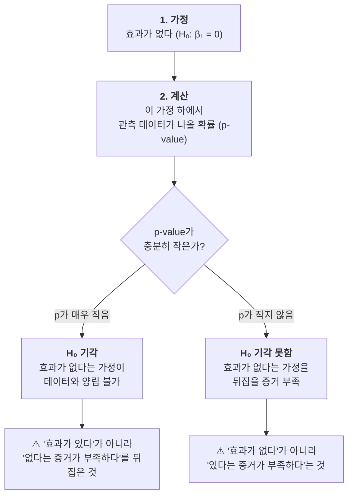
```mermaid
flowchart TD
    A["<b>1. 가정</b><br/>효과가 없다 (H₀: β₁ = 0)"] --> B["<b>2. 계산</b><br/>이 가정 하에서<br/>관측 데이터가 나올 확률 (p-value)"]
    B --> C{p-value가<br/>충분히 작은가?}
    C -->|"p가 매우 작음"| D["<b>H₀ 기각</b><br/>효과가 없다는 가정이<br/>데이터와 양립 불가"]
    C -->|"p가 작지 않음"| E["<b>H₀ 기각 못함</b><br/>효과가 없다는 가정을<br/>뒤집을 증거 부족"]
    D --> F["⚠️ '효과가 있다'가 아니라<br/>'없다는 증거가 부족하다'를 뒤집은 것"]
    E --> G["⚠️ '효과가 없다'가 아니라<br/>'있다는 증거가 부족하다'는 것"]
```

<strong>주의</strong>: " $H_0$ 을 기각하지 못함" ≠ " $H_0$ 이 참". 유죄 판결을 받지 않았다고 무죄인 것은 아닌 것처럼, 기각하지 못했다고 효과가 0인 것은 아니다. 단지 <strong>증거가 부족</strong>할 뿐이다.

### 0.05라는 기준에 대해

$\alpha = 0.05$는 Ronald Fisher가 관행적으로 사용한 기준이 굳어진 것이지, 자연 법칙이 아니다. p = 0.049와 p = 0.051 사이에 본질적 차이는 없다. 그런데도 전자는 "유의하다"로, 후자는 "유의하지 않다"로 출판 여부가 갈린다—이것이 학계에서 p-hacking(유의한 결과가 나올 때까지 분석을 조작하는 행위)이 만연한 배경이다.

### 학계는 이미 움직이고 있다: ASA 성명과 "p < 0.05 이후"의 시대

이 문제가 얼마나 심각한지를 보여주는 것이 <strong>미국통계학회(ASA)</strong>의 공식 성명이다. ASA는 통계학의 최대 학술 단체로, p-value에 대해 공식 입장을 낸 것은 역사상 처음이었다.

<strong>2016년 ASA 성명</strong> — 6가지 원칙:

1. p-value는 데이터가 특정 통계 모형과 얼마나 양립 불가능한지를 나타낼 수 있다
2. p-value는 연구 가설이 참일 확률이나, 데이터가 우연히 생산되었을 확률을 측정하지 <strong>않는다</strong>
3. 과학적 결론, 사업적·정책적 결정은 p-value가 특정 임계값을 넘었는지에만 기반해서는 <strong>안 된다</strong>
4. 적절한 추론을 위해서는 완전한 보고와 투명성이 필요하다
5. p-value 또는 통계적 유의성은 효과의 크기나 결과의 중요성을 측정하지 <strong>않는다</strong>
6. p-value 자체만으로는 모형이나 가설에 대한 좋은 증거를 제공하지 않는다

<strong>2019년 후속 성명</strong> — 더 강한 메시지:

> <strong>"통계적으로 유의하다(statistically significant)"라는 표현 자체를 버려라.</strong>

ASA의 2019년 특별호 사설은 "p < 0.05 이후의 세계"를 선언하며, 40편 이상의 기고문을 통해 대안적 보고 방식을 제시했다. 핵심 메시지는:

- <strong>"유의하다/유의하지 않다"의 이분법을 쓰지 마라.</strong> p = 0.049와 p = 0.051을 질적으로 다른 결과로 취급하는 것은 부당하다
- <strong>효과 크기(effect size)와 신뢰구간(confidence interval)을 중심으로 보고하라.</strong> "$\hat{\beta}_1 = 9.8\%p$, 95% CI [3.7, 15.9]"가 "p < 0.05이므로 유의하다"보다 훨씬 많은 정보를 담고 있다
- <strong>p-value를 보고할 때는 정확한 값을 쓰라.</strong> "p < 0.05"가 아니라 "p = 0.032"로 연속적 값을 보고해야 한다

이 흐름은 이미 주요 학술지에 반영되고 있다. Nature는 p-value 보고를 제한하고 효과 크기와 신뢰구간을 요구하며, The Lancet 계열 저널은 2025년부터 p-value를 "양립성 측도(compatibility measure)"로 재해석하는 가이드라인을 발표했다.

<strong>실용적으로 이것이 의미하는 것</strong>:

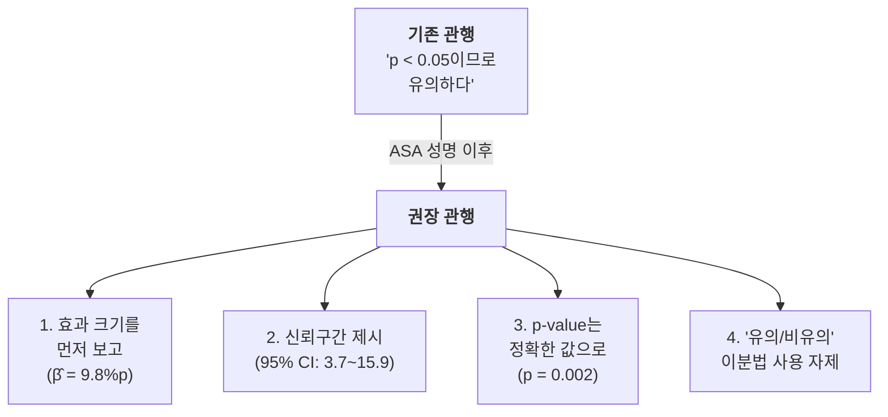
```mermaid
flowchart TD
    A["<b>기존 관행</b><br/>'p < 0.05이므로<br/>유의하다'"] -->|"ASA 성명 이후"| B["<b>권장 관행</b>"]
    B --> C["1. 효과 크기를<br/>먼저 보고<br/>(β̂ = 9.8%p)"]
    B --> D["2. 신뢰구간 제시<br/>(95% CI: 3.7~15.9)"]
    B --> E["3. p-value는<br/>정확한 값으로<br/>(p = 0.002)"]
    B --> F["4. '유의/비유의'<br/>이분법 사용 자제"]
```

이 수업에서도 가급적 이 관행을 따른다. 결과를 보고할 때 "유의하다"라는 한 마디로 끝내지 말고, <strong>효과 크기가 얼마이고, 신뢰구간이 어디이며, 그것이 실질적으로 의미 있는 크기인지</strong>를 함께 판단하는 습관을 들이자.

### 재현 위기(Replication Crisis): 왜 이 모든 논의가 중요한가

위의 p-value 논쟁이 추상적인 학술 논쟁이 아니라 <strong>실제 과학의 신뢰성 위기</strong>로 이어졌다는 것을 이해해야 한다.

<strong>무슨 일이 있었는가</strong>: 2015년, Open Science Collaboration은 심리학의 주요 저널 3곳에 실린 100편의 연구를 재현(replicate)하려 했다. 결과:

- 원래 연구 중 97편이 통계적으로 유의한 결과를 보고했다
- 재현 시도에서 유의한 결과가 나온 것은 <strong>36편(36%)</strong>에 불과했다
- 효과 크기도 원래 연구의 절반 수준으로 줄어들었다

<strong>왜 이런 일이 생겼는가</strong>: 핵심 원인은 <strong>출판 편향(publication bias)</strong>과 그로 인한 <strong>의문스러운 연구 관행(Questionable Research Practices, QRPs)</strong>이다.

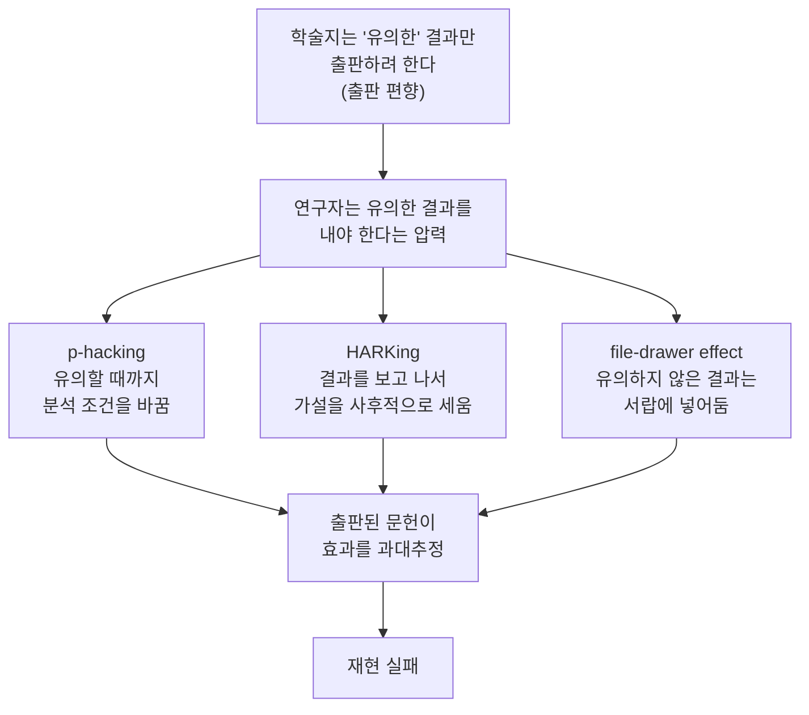
```mermaid
flowchart TD
    A["학술지는 '유의한' 결과만<br/>출판하려 한다<br/>(출판 편향)"] --> B["연구자는 유의한 결과를<br/>내야 한다는 압력"]
    B --> C["p-hacking<br/>유의할 때까지<br/>분석 조건을 바꿈"]
    B --> D["HARKing<br/>결과를 보고 나서<br/>가설을 사후적으로 세움"]
    B --> E["file-drawer effect<br/>유의하지 않은 결과는<br/>서랍에 넣어둠"]
    C --> F["출판된 문헌이<br/>효과를 과대추정"]
    D --> F
    E --> F
    F --> G["재현 실패"]
```

- <strong>p-hacking</strong>: 다양한 통제변수 조합, 이상치 제거 기준, 하위 집단 분석을 시도해서 p < 0.05가 나오는 조합을 "발견"하는 행위. 20가지 분석을 시도하면 그중 하나는 우연히 유의하게 나온다 ($0.05 \times 20 = 1$)
- <strong>HARKing</strong> (Hypothesizing After Results are Known): 데이터를 먼저 분석하고, 유의하게 나온 결과에 맞춰 "원래 이 가설을 검증하려 했다"고 논문을 쓰는 행위
- <strong>file-drawer effect</strong>: 유의하지 않은 결과는 출판되지 않으므로, 출판된 문헌만 보면 효과가 있는 것처럼 보인다

<strong>해결책: 사전등록(Pre-registration)</strong>

이 문제에 대한 학계의 대응이 <strong>사전등록</strong>이다. 데이터를 수집하기 <strong>전에</strong> 가설, 분석 방법, 표본 크기를 공개 저장소(OSF, AsPredicted 등)에 등록해 두는 것이다.

| | 사전등록 없음 | 사전등록 있음 |
|--|--|--|
| <strong>분석 자유도</strong> | 연구자가 결과를 본 후 분석 방법을 조정할 수 있음 | 사전에 확정된 분석 계획을 따라야 함 |
| <strong>p-hacking 가능성</strong> | 높음 | 크게 줄어듦 |
| <strong>HARKing 가능성</strong> | 높음 | 사전 가설이 기록되어 있으므로 불가능 |
| <strong>재현 가능성</strong> | 낮음 (36%) | 높음 (86%—UC Berkeley/Stanford 연구) |

UC Berkeley와 Stanford의 6년간 연구(2024, Nature Human Behaviour)에 따르면, 사전등록 + 대표본 + 엄격한 프로토콜을 지킨 연구의 재현율은 <strong>86%</strong>에 달했다. 일반적 재현율 36%와 극적인 차이다.

<strong>이것이 이 수업과 어떤 관련이 있는가</strong>:

1. <strong>논문을 읽을 때</strong>: "이 연구가 사전등록되었는가?"를 확인하라. 사전등록된 연구의 결과가 더 신뢰할 수 있다
2. <strong>자신의 연구(졸업논문 등)에서</strong>: 분석 전에 가설과 방법을 명확히 정해라. 데이터를 본 후 가설을 바꾸면 p-value의 의미 자체가 사라진다—p-value는 "사전에 정한 가설"을 검정하는 도구이기 때문이다
3. <strong>통계적 유의성을 절대시하지 마라</strong>: p < 0.05라는 결과 하나에 모든 것을 걸지 말고, 효과 크기, 신뢰구간, 재현 가능성, 이론적 맥락을 종합적으로 판단하라

### 베이지언 통계: 왜 더 "직관적인" 해석이 가능한가

빈도주의 p-value의 가장 큰 불만은 <strong>"우리가 진짜 알고 싶은 것에 직접 답하지 않는다"</strong>는 것이다.

- <strong>우리가 알고 싶은 것</strong>: "이 데이터를 본 후, 효과가 있을 확률은 얼마인가?" → $P(\beta_1 \neq 0\ |\ \text{data})$
- <strong>p-value가 답하는 것</strong>: "효과가 없다고 가정하면, 이런 데이터가 나올 확률은 얼마인가?" → $P(\text{data}\ |\ \beta_1 = 0)$

이 둘은 조건부 확률의 조건과 결과가 뒤바뀐 것이다. $P(A|B) \neq P(B|A)$이므로, p-value는 우리가 원하는 답의 "뒤집힌 버전"이다.

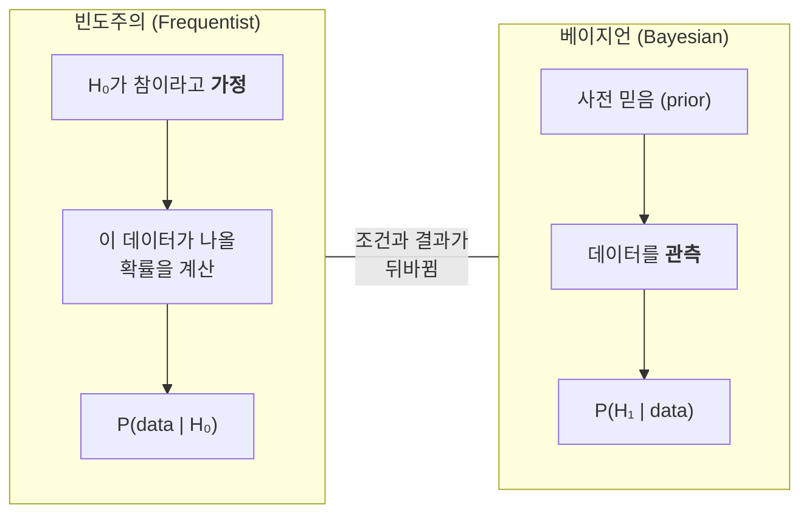
```mermaid
flowchart LR
    subgraph freq ["빈도주의 (Frequentist)"]
        direction TB
        F1["H₀가 참이라고 <b>가정</b>"] --> F2["이 데이터가 나올<br/>확률을 계산"]
        F2 --> F3["P(data | H₀)"]
    end
    subgraph bayes ["베이지언 (Bayesian)"]
        direction TB
        B1["사전 믿음 (prior)"] --> B2["데이터를 <b>관측</b>"]
        B2 --> B3["P(H₁ | data)"]
    end
    freq ---|"조건과 결과가<br/>뒤바뀜"| bayes
```

<strong>베이즈 정리</strong>는 이 뒤집기를 명시적으로 수행한다.

$$P(\beta_1\ |\ \text{data}) = \frac{P(\text{data}\ |\ \beta_1) \cdot P(\beta_1)}{P(\text{data})}$$

$$\underbrace{P(\beta_1\ |\ \text{data})}_{\text{사후 분포 (posterior)}} \propto \underbrace{P(\text{data}\ |\ \beta_1)}_{\text{우도 (likelihood)}} \times \underbrace{P(\beta_1)}_{\text{사전 분포 (prior)}}$$

- <strong>사전 분포 (prior)</strong>: 데이터를 보기 전에 $\beta_1$에 대해 알고 있는 것. "성별이 정치 태도에 영향을 미칠 가능성이 높다"는 기존 연구 결과를 반영할 수 있다
- <strong>우도 (likelihood)</strong>: 특정 $\beta_1$ 값 하에서 관측 데이터가 나올 확률. 이것은 빈도주의에서도 쓰는 것이다
- <strong>사후 분포 (posterior)</strong>: 데이터를 본 후 $\beta_1$에 대한 업데이트된 믿음. <strong>이것이 우리가 진짜 알고 싶은 것이다</strong>

베이지언 분석의 결론은 이렇게 나온다:

> " $\beta_1$ 이 0보다 클 확률이 97.3%다" 또는 " $\beta_1$ 이 [3.2, 16.4] 구간에 있을 확률이 95%다"

이것은 p-value보다 훨씬 직관적이다. "효과가 없다고 가정했을 때 이런 데이터가 나올 확률"이 아니라, <strong>"이 데이터를 봤을 때 효과가 있을 확률"</strong>을 직접 말해주기 때문이다.

<strong>그런데 왜 사회과학에서 여전히 빈도주의를 쓰는가?</strong>

- <strong>사전 분포(prior) 선택의 자의성</strong>: "성별 효과에 대한 사전 믿음"을 어떻게 설정하느냐에 따라 결론이 달라질 수 있다. 빈도주의는 사전 분포가 필요 없으므로 이 논쟁을 피할 수 있다
- <strong>관행과 인프라</strong>: 학계의 심사 기준, 통계 소프트웨어, 교과서가 모두 빈도주의 중심으로 구축되어 있다
- <strong>대표본에서의 수렴</strong>: 표본이 충분히 크면 사전 분포의 영향이 사라지고, 빈도주의와 베이지언의 결론이 거의 동일해진다. 사회과학 서베이처럼 n이 수백~수천이면 실질적 차이가 작다

결국 해석의 편의성 면에서는 베이지언이 우월하지만, 학계의 관행과 실용적 이유로 빈도주의가 여전히 표준이다. 두 접근의 차이와 한계를 아는 것이 중요하다.

### 서베이 예시

10대 청소년 설문에서 "성별 → 부정선거론 수용"을 분석한 결과:

- $\hat{\beta}_{\text{sex}} = 9.8\%p$, $\text{SE} = 3.1\%p$
- $t = 9.8 / 3.1 = 3.16$
- $p = 0.002$

<strong>빈도주의 해석</strong>: "성별이 부정선거론 수용에 아무 효과가 없다($\beta_{\text{sex}} = 0$)는 가정 하에서, 이만큼 큰 차이(9.8%p 이상)가 관측될 확률은 0.2%에 불과하다. 따라서 이 가정은 기각한다."

<strong>베이지언 해석</strong> (비정보적 사전 분포 가정 시): "데이터를 본 후, 남성이 여성보다 부정선거론을 더 많이 수용할 확률은 99.8%이며, 그 차이는 95% 확률로 [3.7%p, 15.9%p] 구간에 있다."

같은 데이터에서 도출된 두 해석이다. 후자가 더 직관적으로 읽힌다.

### 통계적 유의성 ≠ 실질적 유의성

p-value가 작다고 그 효과가 "중요하다"는 뜻이 아니다. 이 구분을 명확히 해두자.

$$t = \frac{\hat{\beta}_1}{\text{SE}(\hat{\beta}_1)}$$

$t$-통계량은 분자(효과 크기)와 분모(표준오차)의 비율이다. 표준오차는 $\text{SE} \approx \frac{\sigma}{\sqrt{n}}$에 비례하므로, <strong>표본이 커지면 $\text{SE}$가 줄어들고, 아무리 작은 $\hat{\beta}_1$이라도 $t$가 커져서 유의하게 나온다.</strong>

<strong>예시</strong>: "소득이 정치 관심도에 미치는 효과"

| 표본 크기 | $\hat{\beta}_1$ | $\text{SE}$ | $t$ | $p$ | 유의한가? | 실질적으로 의미 있는가? |
|-----------|---------|------|------|------|----------|-------------------|
| $n = 500$ | $0.15$ | $0.08$ | $1.88$ | $0.061$ | 아니오 | — |
| $n = 5{,}000$ | $0.15$ | $0.025$ | $6.00$ | $< 0.001$ | 예 | 맥락에 따라 판단 |
| $n = 100{,}000$ | $0.003$ | $0.0008$ | $3.75$ | $< 0.001$ | 예 | <strong>거의 무의미</strong> |

세 번째 행을 보자. $\hat{\beta}_1 = 0.003$은 "소득이 100만 원 올라가면 정치 관심도(0~10점)가 0.003점 오른다"는 뜻이다. 통계적으로는 p < 0.001이지만, 0~10점 척도에서 0.003점은 측정 오차보다 작은 차이다. 이것을 "소득이 정치 관심도에 유의한 영향을 미친다"고 결론 내리면 <strong>기술적으로 맞지만 실질적으로 무의미</strong>하다.

<strong>실용적 원칙</strong>:

1. <strong>p-value만 보지 말고 계수의 크기와 단위를 반드시 함께 보라.</strong> "$\hat{\beta}_1 = 9.8\%p$, p = 0.002"는 효과 크기와 유의성이 모두 있는 좋은 결과다. "$\hat{\beta}_1 = 0.003$점, p < 0.001"은 유의하지만 무의미하다
2. <strong>신뢰구간을 활용하라.</strong> 95% CI가 [0.001, 0.005]라면, 효과의 상한선(0.005)조차 실질적으로 의미 없는 크기인지 판단할 수 있다
3. <strong>표본 크기가 매우 클 때는 특히 주의하라.</strong> 빅데이터 시대에 n이 수만~수십만인 분석이 흔해지면서, "통계적으로 유의하지만 실질적으로 무의미한" 결과가 쏟아지고 있다. p-value는 표본 크기의 함수이기도 하다는 것을 잊지 마라

### 실제 회귀분석 결과표 읽는 법: statsmodels 출력 해부

지금까지 배운 개념들—계수, 표준오차, t-statistic, p-value, $R^2$—이 실제 분석에서는 어떤 모습으로 나타나는가? Python의 `statsmodels` 패키지로 `model.summary()`를 실행하면 다음과 같은 결과가 출력된다.

<strong>예시 상황</strong>: 10대 청소년 1,070명에게 "부정선거론 수용 정도"(0~100)를 묻고, 성별·소득·뉴스소비를 독립변수로 넣어 OLS 회귀를 돌렸다.

```
                            OLS Regression Results
==============================================================================
Dep. Variable:           부정선거론   R-squared:                       0.047
Model:                          OLS   Adj. R-squared:                  0.044
Method:                 Least Squares   F-statistic:                     17.52
Date:                Fri, 21 Mar 2026   Prob (F-statistic):           4.18e-11
Time:                        10:30:00   Log-Likelihood:                -4892.3
No. Observations:                1070   AIC:                             9793.
Df Residuals:                    1066   BIC:                             9812.
Df Model:                           3
Covariance Type:            nonrobust
==============================================================================
                 coef    std err          t      P>|t|      [0.025      0.975]
------------------------------------------------------------------------------
const         32.140      2.871     11.195      0.000      26.506      37.774
성별           9.800      3.100      3.161      0.002       3.717      15.883
소득          -0.042      0.015     -2.800      0.005      -0.071      -0.013
뉴스소비       1.250      0.480      2.604      0.009       0.308       2.192
==============================================================================
Omnibus:                       12.340   Durbin-Watson:                   1.982
Prob(Omnibus):                  0.002   Jarque-Bera (JB):               12.890
Skew:                           0.230   Prob(JB):                        0.002
Kurtosis:                       3.320   Cond. No.                         214.
==============================================================================
```

이 표는 세 블록으로 나뉜다. <strong>상단, 중단, 하단</strong> 각각을 읽는 법을 정리하자.

<strong>상단 블록 — 모형 전체 정보</strong>:

| 항목 | 값 | 의미 | 중요도 |
|------|-----|------|--------|
| Dep. Variable | 부정선거론 | 종속변수 이름 | 확인용 |
| R-squared | 0.047 | 모형이 $Y$ 분산의 4.7%를 설명 | 사회과학에서는 낮아도 문제없음 (섹션 11 참조) |
| Adj. R-squared | 0.044 | 변수 수에 대한 패널티를 반영한 $R^2$ | 마찬가지로 크게 신경 쓸 필요 없음 |
| F-statistic | 17.52 | "모든 독립변수가 동시에 효과 없다"($H_0: \beta_1 = \beta_2 = \beta_3 = 0$)에 대한 검정 | Prob(F)가 작으면 "최소한 하나는 효과가 있다" |
| Prob (F-statistic) | 4.18e-11 | F-test의 p-value | 매우 작으므로 모형 전체가 유의 |
| No. Observations | 1070 | 표본 크기 | CLT 작동 여부 판단 기준 |
| AIC / BIC | 9793 / 9812 | 모형 비교용 지표 (작을수록 좋음). 단독으로는 의미 없고, <strong>다른 모형과 비교할 때만</strong> 사용 | 모형 선택 시에만 참고 |

<strong>중단 블록 — 개별 계수 (가장 중요한 부분)</strong>:

| 열 | 의미 | 읽는 법 |
|----|------|---------|
| coef | $\hat{\beta}$ (추정치) | "이 변수가 한 단위 변할 때 $Y$의 평균적 변화" |
| std err | $\text{SE}(\hat{\beta})$ (표준오차) | 추정치의 불확실성. 작을수록 정밀한 추정 |
| t | $t = \frac{\hat{\beta}}{\text{SE}}$ | 추정치가 표준오차의 몇 배인가. 절댓값이 약 2 이상이면 대체로 유의 |
| P>\|t\| | p-value (양측 검정) | $H_0: \beta = 0$에 대한 p-value. 0.05 미만이면 관례적으로 "유의" |
| [0.025  0.975] | 95% 신뢰구간 | 이 구간이 0을 포함하지 않으면 유의 (p < 0.05와 동치) |

위 결과를 해석하면:

- <strong>성별</strong> ($\hat{\beta} = 9.8$, $p = 0.002$): 남성(=1)이 여성(=0)보다 부정선거론 수용 점수가 평균 9.8점 높다. 95% CI [3.7, 15.9]로 0을 포함하지 않으므로 유의
- <strong>소득</strong> ($\hat{\beta} = -0.042$, $p = 0.005$): 소득이 1만 원 높을수록 부정선거론 점수가 0.042점 낮다. 숫자가 작아 보이지만 단위가 "만 원"이므로, 소득 1,000만 원 차이는 $-0.042 \times 1000 = -42$점 차이 (단위 주의!)
- <strong>뉴스소비</strong> ($\hat{\beta} = 1.25$, $p = 0.009$): 뉴스 소비량이 한 단위 높을수록 부정선거론 점수가 1.25점 높다
- <strong>const</strong> ($\hat{\beta} = 32.14$): 모든 독립변수가 0인 사람의 예측값 (기준 집단: 여성, 소득 0, 뉴스소비 0). 실질적 해석이 어려운 경우가 많다

<strong>하단 블록 — 잔차 진단 (대부분 무시해도 됨)</strong>:

| 항목 | 의미 | 실질적 중요도 |
|------|------|--------------|
| Omnibus / Prob(Omnibus) | 잔차의 정규성 검정 | <strong>무시하라</strong> (섹션 12에서 설명하듯, 대표본에서는 의미 없음) |
| Durbin-Watson | 잔차의 자기상관 검정 (2 근처면 문제없음) | 횡단면 데이터에서는 대체로 신경 안 써도 됨. 시계열에서만 중요 |
| Skew / Kurtosis | 잔차의 비대칭도 / 첨도 | 정규성 관련 → 대표본에서 무시 |
| Jarque-Bera | 또 다른 정규성 검정 | 위와 동일하게 무시 |
| Cond. No. | 조건수 (condition number). 높으면 다중공선성 의심 | VIF와 비슷한 역할. 극단적이지 않으면 무시 |

<strong>요약</strong>: 결과표에서 진짜 중요한 것은 <strong>중단 블록의 coef, P>\|t\|, 신뢰구간</strong>이다. 상단의 $R^2$와 하단의 정규성 검정은 사회과학에서는 대부분 부차적이다.

---

## 8. 다양한 가설적 상황 검증

### 상황 1: Y와 X를 바꿔서 돌리면?

설문 데이터에서 다음 두 회귀를 돌렸다고 하자.

- <strong>모형 A</strong>: $\text{정치관심도}_i = \beta_0 + \beta_1 \cdot \text{소득}_i + \epsilon_i$
- <strong>모형 B</strong>: $\text{소득}_i = \gamma_0 + \gamma_1 \cdot \text{정치관심도}_i + u_i$

$\hat{\beta}_1$과 $\hat{\gamma}_1$은 같을까?

<strong>같지 않다.</strong> OLS 추정치의 공식을 보면:

$$\hat{\beta}_1 = \frac{\text{Cov}(X, Y)}{\text{Var}(X)}, \qquad \hat{\gamma}_1 = \frac{\text{Cov}(X, Y)}{\text{Var}(Y)}$$

분자($\text{Cov}(X,Y)$)는 같지만 분모가 다르다. $\text{Var}(X) \neq \text{Var}(Y)$이면 두 계수는 다른 값을 갖는다. 또한 $\hat{\beta}_1 \times \hat{\gamma}_1 = R^2$이라는 관계가 성립한다 (단순회귀에서).

<strong>실질적 의미</strong>: 회귀분석은 대칭적이지 않다. "소득이 정치관심에 미치는 효과"와 "정치관심이 소득에 미치는 효과"는 수학적으로 다른 질문이고, 다른 답을 준다. 어느 쪽이 독립변수이고 어느 쪽이 종속변수인지는 이론과 연구 설계로 정해야지, 데이터가 알려주지 않는다.

### 상황 2: X에 measurement error가 있다면?

설문에서 "가구 소득"을 물었는데, 응답자가 정확한 소득을 모르거나 과장/축소했다고 하자. 우리가 관측하는 것은 진짜 소득($X_i^{\ast}$)이 아니라 측정 오차가 섞인 $X_i$다.

$$X_i = X_i^{\ast} + v_i \qquad (v_i\text{는 측정 오차, } E[v_i] = 0)$$

이때 진짜 모형은 $Y_i = \beta_0 + \beta_1 X_i^{\ast} + \epsilon_i$인데, 우리는 $X_i^{\ast}$ 대신 $X_i$를 넣어서 돌린다.

결과: <strong>감쇠 편향 (attenuation bias)</strong>이 발생한다.

$$\text{plim}\ \hat{\beta}_1 = \beta_1 \cdot \frac{\text{Var}(X^{\ast})}{\text{Var}(X^{\ast}) + \text{Var}(v)} = \beta_1 \cdot \lambda$$

여기서 $\lambda = \frac{\text{Var}(X^{\ast})}{\text{Var}(X^{\ast}) + \text{Var}(v)}$는 항상 0과 1 사이의 값이므로, <strong>추정치는 항상 0쪽으로 쪼그라든다</strong> (절댓값이 줄어든다). 진짜 효과가 양수여도 더 작게, 음수여도 절댓값이 더 작게 추정된다.

<strong>서베이에서의 시사점</strong>: 소득을 정확히 측정하기 어려운 설문에서는 소득의 효과가 과소추정될 가능성이 높다. 이것이 소득 변수를 연속형이 아니라 구간형(1천만 이하 / 1-3천만 / 3-5천만 / ...)으로 묻는 실용적 이유 중 하나다—정확한 값을 모를 때 구간으로 물으면 측정 오차를 줄일 수 있다.

### 상황 3: Y에 measurement error가 있다면?

이번에는 종속변수에 측정 오차가 있다고 하자. "정치 관심도"를 0~10으로 물었는데, 응답자마다 척도를 다르게 해석한다.

$$Y_i = Y_i^{\ast} + w_i \qquad (w_i\text{는 측정 오차, } E[w_i] = 0)$$

진짜 모형은 $Y_i^{\ast} = \beta_0 + \beta_1 X_i + \epsilon_i$이고, 우리가 관측하는 것은:

$$Y_i = \beta_0 + \beta_1 X_i + (\epsilon_i + w_i)$$

$w_i$가 $X_i$와 독립이라면, 오차항이 $\epsilon_i + w_i$로 커질 뿐이다.

$$\text{plim}\ \hat{\beta}_1 = \beta_1 \quad \text{(편향 없음!)}$$

<strong>Y의 측정 오차는 계수 추정에 편향을 일으키지 않는다.</strong> 다만 오차의 분산이 커지므로 표준오차가 커지고, 따라서 통계적으로 유의하게 나오기가 더 어려워진다 (검정력이 떨어진다).

<strong>서베이에서의 시사점</strong>: 종속변수의 측정이 약간 부정확해도 계수 추정의 편향은 걱정하지 않아도 된다. 다만 표본이 충분히 커야 유의미한 결과를 얻을 수 있다.

### 상황 4: 둘 다 measurement error가 있다면?

$X$에도 $Y$에도 측정 오차가 있으면:

- <strong>$X$의 측정 오차 효과</strong>: 감쇠 편향 → 계수가 0 쪽으로 쪼그라든다
- <strong>$Y$의 측정 오차 효과</strong>: 편향은 없지만 표준오차가 커진다

결합하면 <strong>$X$의 감쇠 편향이 지배적</strong>이다. $\hat{\beta}_1$은 여전히 0 쪽으로 편향되고, 거기에 더해 불확실성도 커진다. 최악의 조합이다.

<strong>서베이에서의 시사점</strong>: 이것이 설문 설계에서 <strong>독립변수의 측정 정확도</strong>가 종속변수보다 더 중요한 이유다. 종속변수가 좀 noisy해도 편향은 없지만, 독립변수가 noisy하면 결론 자체가 왜곡된다.

### 상황 5: X의 단위가 바뀌면? (cm → km)

$$Y_i = \beta_0 + \beta_1 X_i + \epsilon_i$$

$X$의 단위를 cm에서 km로 바꾸면, 새 변수 $X_i' = X_i / 100{,}000$이다.

$$Y_i = \beta_0 + \beta_1' X_i' + \epsilon_i$$

이때 $\beta_1' = \beta_1 \times 100{,}000$이다. 계수의 크기가 바뀌지만 <strong>t-statistic, p-value, $R^2$는 전혀 변하지 않는다.</strong> 단위가 바뀌면 계수의 숫자만 비례해서 바뀌고, 통계적 유의성은 동일하다.

<strong>시사점</strong>: 회귀 계수의 "크기"를 해석할 때는 반드시 단위를 함께 말해야 한다. " $\hat{\beta}_1 = 0.003$ 이니까 효과가 작다"고 단정 짓는 것은 위험하다—$X$의 단위가 뭔지에 따라 실질적 효과 크기는 완전히 달라진다.

### 상황 6: 0과 1만 있는 변수(더미 변수)를 넣으면?

앞의 "변수의 유형과 더미 변수" 섹션에서 이미 다뤘듯, 더미 변수의 계수는 <strong>두 집단 간 평균 차이</strong>다. 여기서 한 가지만 추가하자.

더미 변수를 넣은 회귀분석에서 $\hat{\beta}_1$은 곧 "기준 집단 대비 해당 집단의 평균 차이"이므로, <strong>계수의 단위는 $Y$의 단위와 같다</strong>. 연속형 변수의 계수가 " $X$ 한 단위당 $Y$ 의 변화"인 것과 달리, 더미 변수의 계수는 "해당 집단에 속하면 $Y$ 가 얼마나 다른가"를 직접 나타낸다. 해석이 더 직관적이다.

### 상황 7: 변수 간 "영향력 크기"를 비교하고 싶다면? — 표준화 계수

회귀분석 결과를 보다 보면 자연스럽게 드는 질문이 있다: "소득의 효과와 교육연수의 효과 중 뭐가 더 큰가?"

그런데 비표준화 계수(unstandardized coefficient, $b$)로는 이 비교가 불가능하다.

- $\hat{\beta}_{\text{소득}} = 0.003$ (단위: 만 원당 점수 변화)
- $\hat{\beta}_{\text{교육}} = 1.200$ (단위: 연수당 점수 변화)

숫자만 보면 교육연수의 효과가 400배 큰 것 같지만, 그냥 단위가 다를 뿐이다. 소득을 "억 원" 단위로 바꾸면 $\hat{\beta}_{\text{소득}} = 300$이 되어 갑자기 교육보다 커진다. <strong>단위에 따라 크기가 달라지므로 비표준화 계수끼리는 직접 비교할 수 없다.</strong>

<strong>표준화 계수(standardized coefficient, $\beta^{\ast}$)</strong>는 이 문제를 해결한다.

$$\beta^{\ast}_j = \hat{\beta}_j \times \frac{s_{X_j}}{s_Y}$$

여기서 $s_{X_j}$는 $X_j$의 표준편차, $s_Y$는 $Y$의 표준편차다. 이것은 $X_j$와 $Y$를 모두 표준화(평균 0, 표준편차 1)한 뒤 회귀를 돌린 것과 동일하다.

<strong>해석이 달라진다:</strong>

| | 비표준화 계수 ($b$) | 표준화 계수 ($\beta^{\ast}$) |
|--|--|--|
| <strong>해석</strong> | "$X$가 <strong>1단위</strong> 변할 때 $Y$의 변화" | "$X$가 <strong>1 표준편차</strong> 변할 때 $Y$가 <strong>몇 표준편차</strong> 변하는가" |
| <strong>단위</strong> | $X$와 $Y$의 원래 단위에 의존 | 단위 없음 (무차원) |
| <strong>변수 간 비교</strong> | 불가능 | <strong>가능</strong> |
| <strong>실질적 해석</strong> | "소득 100만 원↑ → 정치관심 0.3점↑" | "소득이 상대적으로 교육보다 더 중요한 예측변수다" |

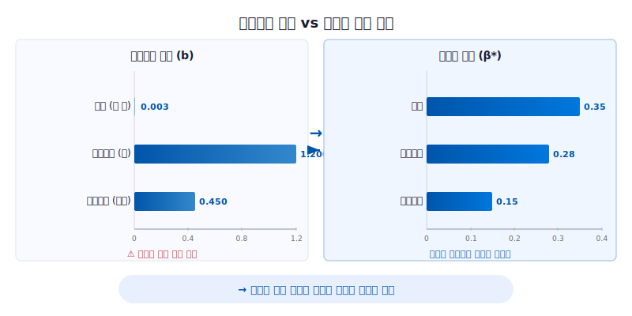

<strong>서베이 예시</strong>: 부정선거론 수용에 대한 회귀분석 결과

| 변수 | $b$ (비표준화) | $\beta^{\ast}$ (표준화) | 해석 |
|------|-------------|----------------|------|
| 소득 (만 원) | $-0.042$ | $-0.35$ | 소득의 상대적 영향력이 가장 크다 |
| 교육연수 (년) | $1.200$ | $0.28$ | 두 번째로 큰 영향 |
| 뉴스소비 (시간/일) | $0.450$ | $0.15$ | 상대적으로 영향이 가장 작다 |

비표준화 계수만 보면 교육연수(1.200)가 가장 커 보이지만, 표준화 계수로 보면 소득(0.35)의 상대적 영향력이 가장 크다. 소득의 분포가 넓기 때문에(표준편차가 크기 때문에), 작은 계수($-0.042$)도 표준화하면 큰 영향력으로 나타난다.

<strong>주의사항</strong>:

- <strong>표준화 계수는 더미 변수에 적용하면 해석이 어렵다.</strong> 성별(0/1)의 표준편차는 약 0.5인데, "성별이 0.5 표준편차 변한다"는 말은 직관적이지 않다. 더미 변수는 비표준화 계수로 해석하는 것이 낫다
- <strong>표본이 다르면 표준화 계수도 달라진다.</strong> $s_X$와 $s_Y$는 표본의 특성이므로, 다른 연구의 표준화 계수와 직접 비교하는 것은 주의가 필요하다
- <strong>실질적 해석이 필요할 때는 비표준화 계수가 더 유용하다.</strong> "소득 100만 원 차이가 정치관심 몇 점 차이를 만드는가?"라는 구체적 질문에는 $b$가 답한다

<strong>결론</strong>: 비표준화 계수($b$)는 "실질적 해석"에, 표준화 계수($\beta^{\ast}$)는 "상대적 중요도 비교"에 쓴다. 논문에서는 보통 둘 다 보고한다.

### 상황 8: 로그를 씌우면 해석이 어떻게 달라지는가?

사회과학에서 소득, GDP, 인구, 기업 매출 등은 거의 항상 <strong>로그 변환</strong>을 해서 회귀모형에 넣는다. 이유는 두 가지다.

1. <strong>분포의 비대칭성 완화</strong>: 소득은 오른쪽으로 크게 꼬리가 긴 분포(소수의 고소득자)를 갖는데, 로그를 씌우면 분포가 대칭에 가까워진다
2. <strong>비율적 해석이 자연스러움</strong>: 소득이 100만 원 → 200만 원으로 오르는 것과, 5,000만 원 → 5,100만 원으로 오르는 것은 같은 "100만 원"이지만 의미가 전혀 다르다. 로그를 쓰면 "절대 변화"가 아니라 "비율적 변화(%)"로 해석할 수 있다

로그 변환 여부에 따라 <strong>계수의 해석이 완전히 달라진다</strong>. 네 가지 조합을 정리하면:

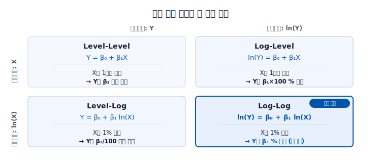

| 모형 | 수식 | $\hat{\beta}_1$의 해석 |
|------|------|----------------------|
| <strong>Level-Level</strong> | $Y = \beta_0 + \beta_1 X$ | $X$가 1단위↑ → $Y$가 $\beta_1$단위↑ |
| <strong>Log-Level</strong> | $\ln(Y) = \beta_0 + \beta_1 X$ | $X$가 1단위↑ → $Y$가 약 $\beta_1 \times 100$%↑ |
| <strong>Level-Log</strong> | $Y = \beta_0 + \beta_1 \ln(X)$ | $X$가 1%↑ → $Y$가 약 $\beta_1 / 100$단위↑ |
| <strong>Log-Log</strong> | $\ln(Y) = \beta_0 + \beta_1 \ln(X)$ | $X$가 1%↑ → $Y$가 약 $\beta_1$%↑ <strong>(탄력성)</strong> |

<strong>Log-Level의 근사</strong>: 왜 $\hat{\beta}_1$에 100을 곱하면 %가 되는가?

$\ln(Y)$의 미소 변화 $\Delta \ln(Y) \approx \frac{\Delta Y}{Y}$이다 (자연로그의 성질). 따라서:

$$\Delta \ln(Y) = \beta_1 \cdot \Delta X \quad \Rightarrow \quad \frac{\Delta Y}{Y} \approx \beta_1 \cdot \Delta X$$

$\Delta X = 1$이면 $\frac{\Delta Y}{Y} \approx \beta_1$, 즉 $Y$가 $\beta_1 \times 100$% 변한다. 단, 이 근사는 $\beta_1$이 작을 때(보통 $|\beta_1| < 0.1$) 정확하다. $\beta_1$이 크면 정확한 계산은 $\%\Delta Y = (e^{\beta_1} - 1) \times 100$이다.

<strong>서베이 예시</strong>: 가구 소득(만 원)과 정치 관심도(0~10점)의 관계

<strong>Level-Level</strong>:

$$\text{정치관심}_i = 3.2 + 0.00015 \cdot \text{소득}_i$$

"소득이 100만 원 높으면 정치 관심도가 0.015점 높다." → 해석은 가능하지만, 소득 1만 원 단위의 변화는 너무 작아서 계수가 의미 없어 보인다.

<strong>Level-Log</strong>:

$$\text{정치관심}_i = -2.1 + 1.35 \cdot \ln(\text{소득}_i)$$

"소득이 1% 높으면 정치 관심도가 0.0135점 높다." 또는 "소득이 2배(100%↑)이면 정치 관심도가 약 $1.35 \times \ln(2) = 0.94$점 높다." → 이쪽이 훨씬 자연스럽다. 소득처럼 분포가 넓은 변수는 <strong>비율적 변화</strong>로 생각하는 것이 맞기 때문이다.

<strong>실용적 원칙</strong>:

1. <strong>오른쪽 꼬리가 긴 변수</strong>(소득, 인구, 매출 등)에는 로그를 씌워라. 해석도 자연스럽고, 이상치의 영향도 줄어든다
2. <strong>이미 범위가 좁은 변수</strong>(0~10 척도, 비율 등)에는 로그를 씌우지 마라. 비율적 해석이 오히려 부자연스럽다
3. <strong>0이나 음수가 있으면 로그를 직접 못 씌운다.</strong> $\ln(0) = -\infty$이므로, $\ln(\text{소득} + 1)$ 같은 변환을 쓰거나, IHS(inverse hyperbolic sine) 변환 등을 고려한다
4. <strong>논문에서 $\ln$이 보이면 계수 해석을 반드시 확인하라.</strong> Level-Level과 Log-Level에서 같은 계수 "0.05"가 완전히 다른 의미를 가진다

### 상황 9: 관계가 직선이 아니라면? — 2차(quadratic) 모형

지금까지 우리는 $X$와 $Y$의 관계가 <strong>직선</strong>이라고 가정해 왔다. 그런데 현실에서 모든 관계가 직선일까?

<strong>예시 — 페미니즘 지지와 트랜스젠더 권리 지지</strong>: 5점 리커트 척도로 "페미니즘 지지도"를 측정하고, 0~10점으로 "트랜스젠더 권리 지지도"를 측정했다고 하자. 직관적으로 "페미니즘 지지가 높을수록 트랜스젠더 권리도 지지하겠지"라고 생각할 수 있다. 그런데 데이터를 보면 이야기가 다르다.

- 페미니즘 지지가 낮은 사람(1~2점): 트랜스젠더 권리 지지도 낮다
- 페미니즘 지지가 중간인 사람(3점): 트랜스젠더 권리 지지가 <strong>가장 높다</strong>
- 페미니즘 지지가 매우 높은 사람(4~5점): 오히려 트랜스젠더 권리 지지가 <strong>낮아진다</strong>

이것은 <strong>역 U자형(inverted-U)</strong> 패턴이다. 페미니즘을 강하게 지지하는 사람 중 일부는 "생물학적 성별에 기반한 여성의 권리"를 강조하면서 트랜스젠더 포용에 비판적인 입장(이른바 TERF적 관점)을 취하기 때문이다. 직선 모형으로는 이 패턴을 절대 포착할 수 없다.

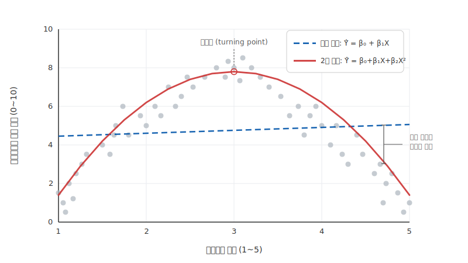

<strong>선형 모형 — 놓치는 것이 있다</strong>:

$$Y_i = \beta_0 + \beta_1 \cdot \text{페미니즘}_i + \epsilon_i$$

이 모형은 관계를 직선으로만 요약한다. 약한 양의 기울기($\hat{\beta}_1 > 0$)가 나오겠지만, 역 U자의 하강 부분을 완전히 놓친다. $R^2$도 낮을 것이다.

<strong>2차(quadratic) 모형 — 곡선을 포착한다</strong>:

$$Y_i = \beta_0 + \beta_1 \cdot \text{페미니즘}_i + \beta_2 \cdot \text{페미니즘}_i^2 + \epsilon_i$$

$X^2$ 항을 추가한 것뿐인데, 이제 곡선 관계를 모형화할 수 있다.

- $\beta_2 < 0$이면: <strong>역 U자형</strong> (위로 볼록) — 처음에 오르다가 꺾여서 내려온다
- $\beta_2 > 0$이면: <strong>U자형</strong> (아래로 볼록) — 처음에 내려가다가 꺾여서 올라간다

<strong>전환점(turning point)</strong>은 미분으로 구한다:

$$\frac{\partial Y}{\partial X} = \beta_1 + 2\beta_2 X = 0 \quad \Rightarrow \quad X^{\ast} = -\frac{\beta_1}{2\beta_2}$$

위 예시에서 $\hat{\beta}_1 = 4.8$, $\hat{\beta}_2 = -0.8$이라면, 전환점은 $X^{\ast} = -\frac{4.8}{2 \times (-0.8)} = 3.0$이다. 페미니즘 지지 3점까지는 트랜스젠더 권리 지지가 증가하고, 3점을 넘으면 감소한다.

<strong>중요한 점: 2차항은 OLS의 "선형성" 가정을 위반하지 않는다.</strong> OLS에서 "선형"이란 <strong>모수에 대한 선형</strong>이지, $X$에 대한 선형이 아니다. $Y = \beta_0 + \beta_1 X + \beta_2 X^2$에서 $\beta_0$, $\beta_1$, $\beta_2$는 여전히 선형으로 결합되어 있으므로, 일반적인 OLS로 추정할 수 있다. $X^2$을 새 변수 $Z = X^2$로 보면, 이것은 그냥 변수가 하나 더 있는 다중회귀일 뿐이다.

### 선형인지 2차인지, 어떻게 판단하는가?

<strong>통계적 검정</strong>: $\beta_2 = 0$인지 검정하면 된다. 2차항을 넣어서 회귀를 돌리고, $\hat{\beta}_2$의 p-value가 유의하면 "직선이 아니라 곡선이 더 적합하다"는 증거다.

하지만 <strong>이것만으로는 부족하다.</strong> 여기가 핵심이다.

<strong>왜 사회과학적 직관이 필요한가</strong>:

1. <strong>데이터만으로는 함수 형태를 결정할 수 없다.</strong> 같은 데이터에 2차, 3차, 로그, 지수 등 다양한 함수를 씌울 수 있고, 차수를 올릴수록 $R^2$는 올라간다. 극단적으로, $n$개 데이터에 $n-1$차 다항식을 씌우면 모든 점을 완벽히 지나간다($R^2 = 1$). 하지만 이것은 데이터를 "이해"한 것이 아니라 "외운" 것이다

2. <strong>2차항을 넣는 것은 이론적 정당화가 필요하다.</strong> 위 예시에서 "페미니즘 지지가 높아질수록 한 방향으로만 효과가 있다"는 것이 당연한가? 아니면 "일정 수준 이후에는 역전될 수 있는 이론적 이유가 있는가?"를 먼저 물어야 한다. TERF 현상이라는 이론적 근거가 있기 때문에 역 U자를 의심할 수 있는 것이다

3. <strong>모든 관계에 2차항을 넣는 것은 좋은 전략이 아니다.</strong> "혹시 곡선일지 모르니까 다 넣어보자"는 접근은 다중비교 문제를 일으키고, 과적합(overfitting)의 위험이 있다. 변수 10개에 각각 2차항을 넣으면 독립변수가 20개가 되고, 그중 일부는 우연히 유의하게 나올 수 있다

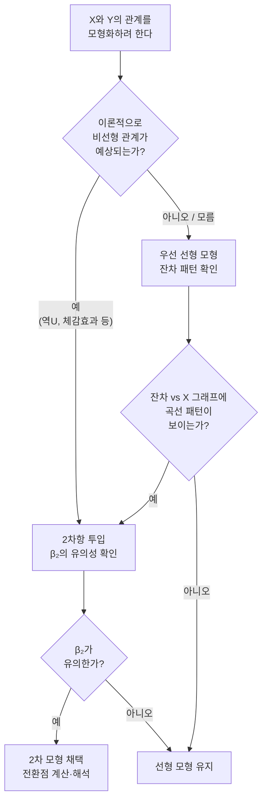
```mermaid
flowchart TD
    A["X와 Y의 관계를<br/>모형화하려 한다"] --> B{"이론적으로<br/>비선형 관계가<br/>예상되는가?"}
    B -->|"예<br/>(역U, 체감효과 등)"| C["2차항 투입<br/>β₂의 유의성 확인"]
    B -->|"아니오 / 모름"| D["우선 선형 모형<br/>잔차 패턴 확인"]
    D --> E{"잔차 vs X 그래프에<br/>곡선 패턴이<br/>보이는가?"}
    E -->|"예"| C
    E -->|"아니오"| F["선형 모형 유지"]
    C --> G{"β₂가<br/>유의한가?"}
    G -->|"예"| H["2차 모형 채택<br/>전환점 계산·해석"]
    G -->|"아니오"| F
```

<strong>실용적 조언</strong>:

- <strong>이론이 먼저다.</strong> "체감 효과가 있을 것이다", "일정 수준 이후 역전될 것이다" 같은 이론적 근거가 있을 때 2차항을 넣어라
- <strong>잔차 플롯을 확인하라.</strong> 잔차 vs. 적합값 그래프에서 U자나 역 U자 패턴이 보이면 비선형성의 증거다
- <strong>전환점이 데이터 범위 안에 있는지 확인하라.</strong> 전환점이 $X^{\ast} = 15$인데 데이터의 $X$ 범위가 1~5라면, 사실상 관찰 범위 내에서는 단조(monotonic) 관계이므로 2차항의 실질적 의미가 없다
- <strong>해석 가능성을 유지하라.</strong> 3차, 4차까지 올릴 수 있지만, 사회과학에서 "3차항의 의미"를 이론적으로 설명하기는 매우 어렵다. 2차까지가 보통 해석의 한계다

---

## 9. 교차효과(interaction effect)는 무엇이고 어떻게 해석해야 하는가?

### 교차효과란

교차효과란 <strong>한 독립변수의 효과가 다른 독립변수의 값에 따라 달라지는 것</strong>이다.

교차항이 없는 모형:

$$Y_i = \beta_0 + \beta_1 X_{1i} + \beta_2 X_{2i} + \epsilon_i$$

이 모형에서 $X_1$의 효과는 항상 $\beta_1$이다. $X_2$가 뭐든 상관없이.

교차항이 있는 모형:

$$Y_i = \beta_0 + \beta_1 X_{1i} + \beta_2 X_{2i} + \beta_3 (X_{1i} \times X_{2i}) + \epsilon_i$$

이제 $X_1$의 효과를 구하려면 $X_1$에 대해 편미분해야 한다:

$$\frac{\partial Y}{\partial X_1} = \beta_1 + \beta_3 X_2$$

<strong>$X_1$의 효과가 $X_2$의 값에 따라 달라진다.</strong> 이것이 교차효과다.

### 더미 × 연속형: 그래프로 보는 교차효과

가장 직관적인 경우는 <strong>더미 변수 × 연속형 변수</strong>의 교차항이다. 서베이 예시로 보자.

"소득이 부정선거론 수용에 미치는 효과가 성별에 따라 다른가?"

$$\text{부정선거론}_i = \beta_0 + \beta_1 \cdot \text{Sex}_i + \beta_2 \cdot \text{소득}_i + \beta_3 \cdot (\text{Sex}_i \times \text{소득}_i) + \epsilon_i$$

이 모형을 성별로 분리하면:

- <strong>여성</strong> ($\text{Sex} = 0$): $\hat{Y} = \beta_0 + \beta_2 \cdot \text{소득}$
- <strong>남성</strong> ($\text{Sex} = 1$): $\hat{Y} = (\beta_0 + \beta_1) + (\beta_2 + \beta_3) \cdot \text{소득}$

<strong>예시 A — 양의 기울기</strong>: "교육연수가 정치 관심도에 미치는 효과가 성별에 따라 다른가?"

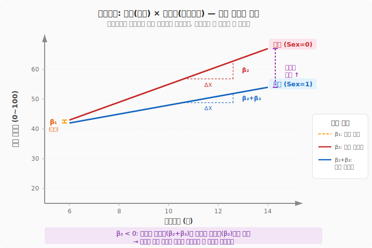

여성의 기울기($\beta_2$)가 남성의 기울기($\beta_2 + \beta_3$)보다 크다. $\beta_3 < 0$이므로 교육의 효과가 여성에서 더 강하게 나타난다. 두 직선은 왼쪽(저학력)에서 가깝다가 오른쪽(고학력)으로 갈수록 벌어진다.

<strong>예시 B — 음의 기울기</strong>: 가령 $\hat{\beta}_0 = 35$, $\hat{\beta}_1 = 10$, $\hat{\beta}_2 = -0.5$, $\hat{\beta}_3 = -0.3$이라면:

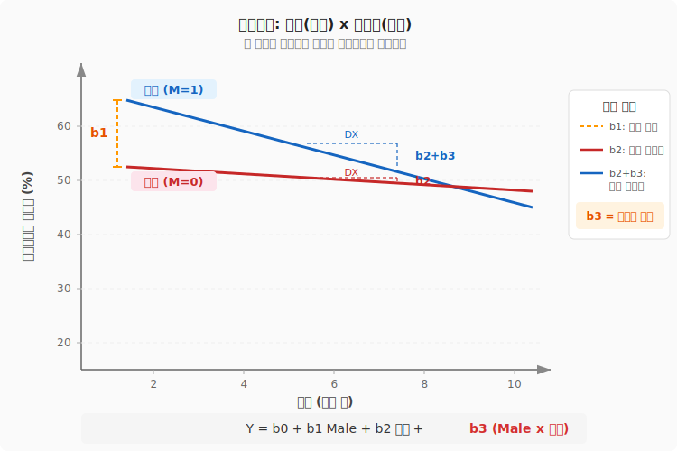

남성의 기울기($\beta_2 + \beta_3 = -0.8$)가 여성의 기울기($\beta_2 = -0.5$)보다 절댓값이 크다. 소득이 올라갈수록 부정선거론 수용이 줄어드는데, 그 감소 폭이 남성에서 더 크다.

<strong>핵심 포인트</strong>:

- <strong>$\beta_1 = 10$</strong>: 두 직선의 <strong>절편 차이</strong> = 소득이 0일 때 남녀 차이 (실질적 의미는 제한적)
- <strong>$\beta_3 = -0.3$</strong>: 두 직선의 <strong>기울기 차이</strong> = 소득 효과가 성별에 따라 얼마나 다른지. 남성에서 소득의 효과($-0.8$)가 여성($-0.5$)보다 더 크다

<strong>교차효과가 없다면</strong> ($\beta_3 = 0$): 두 직선은 <strong>평행</strong>하다—절편만 다르고 기울기는 같다. 즉, 소득의 효과가 남녀 모두에서 동일하다. 교차효과가 있다는 것은 두 직선이 <strong>평행하지 않다</strong>는 것이다.

### 해석 시 흔한 실수

<strong>실수 1: 주효과만 보고 결론 내기</strong>

교차항이 모형에 들어가 있으면, $\beta_1$과 $\beta_2$의 해석이 완전히 달라진다. 교차항 없는 모형의 $\beta_1$과 교차항 있는 모형의 $\beta_1$은 <strong>다른 것을 의미한다</strong>. 교차항이 있을 때 $\beta_1$은 " $X_2 = 0$ 일 때의 효과"이지, "평균적 효과"가 아니다.

<strong>실수 2: 교차항이 유의하지 않다고 "교차효과가 없다"고 결론 내기</strong>

p = 0.15라고 "효과가 없다"고 단정하면 안 된다. 표본이 작아서 검정력이 부족했을 수 있다.

<strong>실수 3: 교차항만 넣고 주효과를 빼기</strong>

$$Y_i = \beta_0 + \beta_3 (X_1 \times X_2) + \epsilon_i \quad \leftarrow \text{이렇게 하면 안 된다}$$

교차항을 넣을 때는 반드시 구성 요소인 $X_1$과 $X_2$의 주효과도 함께 넣어야 한다. 그렇지 않으면 교차항이 주효과까지 흡수해버려서 해석이 불가능해진다.

### 더미 × 더미 교차항

두 변수가 모두 더미(0/1)이면 해석이 더 직관적이다.

$$Y_i = \beta_0 + \beta_1 \cdot \text{Sex}_i + \beta_2 \cdot \text{서울}_i + \beta_3 \cdot (\text{Sex}_i \times \text{서울}_i) + \epsilon_i$$

| | 서울 아님 | 서울 |
|---|---|---|
| <strong>여성</strong> | $\beta_0$ | $\beta_0 + \beta_2$ |
| <strong>남성</strong> | $\beta_0 + \beta_1$ | $\beta_0 + \beta_1 + \beta_2 + \beta_3$ |

- $\beta_1$: 비서울 지역에서의 성별 차이
- $\beta_2$: 여성 중 서울 vs. 비서울 차이
- $\beta_3$: "서울에서의 성별 차이" - "비서울에서의 성별 차이" = <strong>성별 효과가 지역에 따라 얼마나 다른지</strong>

---

## 10. 왜 매개효과와 조절효과를 구분하는 것은 어렵고 outdated된 접근인가

### 전통적 구분

학부 통계에서 흔히 배우는 구분:

- <strong>매개효과 (mediation)</strong>: $X \to M \to Y$. $X$의 효과가 매개변수 $M$을 "거쳐서" $Y$에 도달한다
  - 예: 성별 → 온라인 커뮤니티 노출 → 부정선거론 수용
- <strong>조절효과 (moderation)</strong>: $X$의 효과가 조절변수 $W$에 따라 "달라진다"
  - 예: 소득 → 부정선거론인데, 그 효과가 성별에 따라 다르다 (= 앞서 다룬 교차효과)

교과서에서는 이 둘을 깔끔하게 구분하지만, 실제 연구에서 이 구분은 <strong>훨씬 모호하고 위험하다</strong>.

### 왜 이 구분이 문제인가

<strong>문제 1: 매개 분석(Baron & Kenny 방법)의 근본적 한계</strong>

전통적 매개 분석(Baron & Kenny, 1986)은 다음 3단계를 따른다:
1. $X$가 $Y$에 유의한 효과 → $Y = c X$
2. $X$가 $M$에 유의한 효과 → $M = a X$
3. $M$을 통제하면 $X$의 효과가 줄어듦 → $Y = c'X + bM$, 여기서 $|c'| < |c|$

문제는 <strong>3단계에서 $M$을 통제하는 것이 인과적으로 정당한지 보장할 수 없다</strong>는 것이다. $M$이 $X$에 의해 영향받는 변수라면 이를 통제하는 것은 "bad control"이 될 수 있다 (다음 섹션 참조). $M$을 넣었을 때 $X$의 계수가 줄어드는 것이, 정말로 $M$이 매개하기 때문인지, 아니면 $M$을 넣음으로써 새로운 편향이 생긴 것인지 구분할 수 없다.

<strong>문제 2: 매개인지 조절인지는 이론이 결정하지, 데이터가 결정하지 않는다</strong>

"온라인 커뮤니티 노출"이 매개변수인지 조절변수인지는 데이터를 보고 결정할 수 있는 것이 아니다.
- 매개로 보면: 성별 → 커뮤니티 노출 → 부정선거론
- 조절로 보면: 성별 → 부정선거론인데, 커뮤니티 노출 정도에 따라 효과가 다르다

같은 세 변수(성별, 커뮤니티 노출, 부정선거론)에 대해 매개 모형과 조절 모형 모두 세울 수 있고, 둘 다 통계적으로 유의하게 나올 수 있다. <strong>어느 쪽이 맞는지는 인과적 이론과 연구 설계의 문제이지, 회귀 계수가 유의한지의 문제가 아니다.</strong>

<strong>문제 3: 현대 인과추론은 이 프레임을 넘어섰다</strong>

2010년대 이후 인과추론 분야에서는 Baron & Kenny 식의 매개 분석이 심각한 한계가 있음이 널리 인정되었다. 매개효과의 인과적 식별(causal identification of mediation)을 위해서는 <strong>순차적 무시가능성(sequential ignorability)</strong>이라는 매우 강한 가정이 필요한데, 관측 데이터에서 이 가정은 거의 검증 불가능하다. 현대 인과추론은 매개/조절의 이분법 대신, <strong>DAG(Directed Acyclic Graph)</strong>를 통해 변수 간 인과 구조를 명시하고, 그 구조에서 어떤 변수를 통제해야 하는지를 도출하는 방식을 택한다.

### 실용적 조언

1. "매개효과 분석"이라는 이름의 Baron & Kenny 방식은 가급적 쓰지 마라
2. 교차항(interaction)은 명확하고 해석 가능하다. "매개인가 조절인가"를 구분하려 하기보다, <strong>교차항을 넣어서 효과의 이질성(heterogeneous effects)을 확인</strong>하는 것이 더 실용적이다
3. "이 변수를 통제해야 하는가?"라는 질문은 매개/조절 구분이 아니라, <strong>인과 구조(DAG)</strong>에 근거해서 판단해야 한다 → 바로 다음 섹션에서 다룬다

---

## 11. 통제변수는 언제 넣어야 하고, 언제 넣으면 안 되는가 (Bad Control)

### "통제변수를 많이 넣을수록 좋다"는 신화

학부 통계에서 흔히 듣는 조언: "교란 변수를 최대한 많이 통제해야 편향이 줄어든다." 이것은 반은 맞고 반은 틀리다. <strong>잘못된 변수를 통제하면 오히려 편향이 생긴다.</strong> 이것을 <strong>bad control</strong> 문제라 한다.

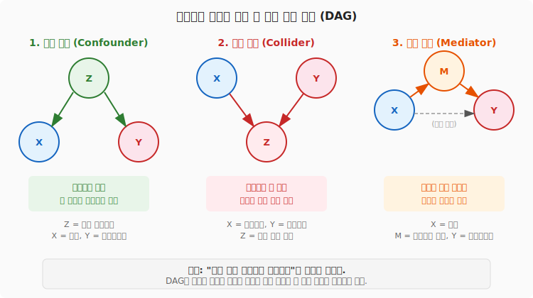

### 넣어야 하는 통제변수: 교란 변수 (Confounder)

<strong>교란 변수</strong>: $X$에도 영향을 미치고 $Y$에도 영향을 미치는 변수.

예: 부모의 정치성향이 보수적인 가정 → 아들·딸 모두 보수적 성향 + 부정선거론 수용 경향. 이때 성별과 부정선거론의 관계에 부모 정치성향이 섞여 들어간다. <strong>이 경우 Z를 통제해야 순수한 성별 효과를 추정할 수 있다.</strong>

### 넣으면 안 되는 통제변수 ①: 결과 변수의 후손 (Collider)

충돌 변수(collider)란 $X$와 $Y$ <strong>양쪽으로부터</strong> 영향을 받는 변수다. $X \to Z \leftarrow Y$ 구조. 이때 $Z$를 통제하면 원래 없던 $X$와 $Y$ 사이의 <strong>가짜 상관(spurious correlation)</strong>이 생긴다.

<strong>직관적 예시 — 대학 입학</strong>: 어떤 대학이 "학업 능력"과 "체육 능력" 두 기준으로 학생을 선발한다고 하자. 모집단 전체에서 학업 능력과 체육 능력은 아무 상관이 없다(공부 잘하는 사람이 운동도 잘하는 것은 아니다). 그런데 <strong>합격자(= 대학생)만 골라서 보면</strong>, 학업 능력과 체육 능력 사이에 음의 상관이 나타난다. 왜냐하면 합격하려면 둘 중 하나는 높아야 하므로, 합격자 집단 안에서는 "공부를 못하면 운동은 잘해야 했을 것"이라는 관계가 생기기 때문이다.

이것이 충돌 편향(collider bias)이다. "대학 합격 여부"($Z$)는 학업 능력($X$)과 체육 능력($Y$) 양쪽에 의해 결정되는 충돌 변수다. $Z$를 통제(= 합격자만 분석)하면, 원래 없던 $X$-$Y$ 간 가짜 상관이 만들어진다.

<strong>서베이에서의 예시</strong>: 성별($X$)이 부정선거론 수용($Y$)에 미치는 효과를 분석하는데, "정치 관련 설문 응답 의향"($Z$)을 통제한다고 하자. 성별도 응답 의향에 영향을 미치고(남성이 정치 설문에 더 적극적), 부정선거론 신봉 정도도 응답 의향에 영향을 미친다(강한 의견을 가진 사람이 설문에 더 응답). 이때 응답 의향을 통제하면—예컨대 "적극 응답자"만 분석하면—성별과 부정선거론 사이에 실제로는 없는 관계가 나타나거나, 실제 관계가 왜곡될 수 있다. <strong>$Z$를 통제하면 안 된다.</strong>

### 넣으면 안 되는 통제변수 ②: 매개 변수 (Mediator)

성별이 부정선거론에 미치는 효과의 일부가 온라인 커뮤니티 노출을 "경유"한다면, $M$을 통제하는 것은 <strong>$X$가 $Y$에 도달하는 경로 하나를 차단</strong>하는 것이다. 이렇게 하면 $X$의 <strong>총 효과(total effect)</strong>가 아니라 $M$을 거치지 않는 <strong>직접 효과(direct effect)</strong>만 남는다.

- 총 효과를 알고 싶다면: $M$을 넣지 마라
- 직접 효과를 알고 싶다면: $M$을 넣어야 하지만, 이때 순차적 무시가능성 가정이 필요하다 (위 매개효과 섹션 참조)

<strong>문제는 많은 연구에서 매개변수를 "통제변수"라는 이름으로 아무 생각 없이 넣는다는 것이다.</strong> "관련 있어 보이니까 통제했다"는 것이 가장 흔한, 그리고 가장 위험한 실수다.

### 판단 기준 요약

| 변수의 성격 | 인과 구조 | 통제해야 하는가? |
|------------|----------|-------------|
| <strong>교란 변수</strong> (X, Y 모두에 영향) | $Z \to X$, $Z \to Y$ | <strong>넣어야 한다</strong> (안 넣으면 누락 변수 편향) |
| <strong>충돌 변수</strong> (X, Y로부터 영향 받음) | $X \to Z$, $Y \to Z$ | <strong>넣으면 안 된다</strong> (넣으면 가짜 상관 생성) |
| <strong>매개 변수</strong> (X→M→Y 경로상) | $X \to M \to Y$ | <strong>목적에 따라 다르다</strong> (총 효과 원하면 빼고, 직접 효과 원하면 넣되 주의) |
| <strong>X, Y와 무관한 변수</strong> | 인과 경로 없음 | 넣어도 편향은 안 생기지만, 자유도만 낭비한다 |

### 통제변수 의사결정 흐름

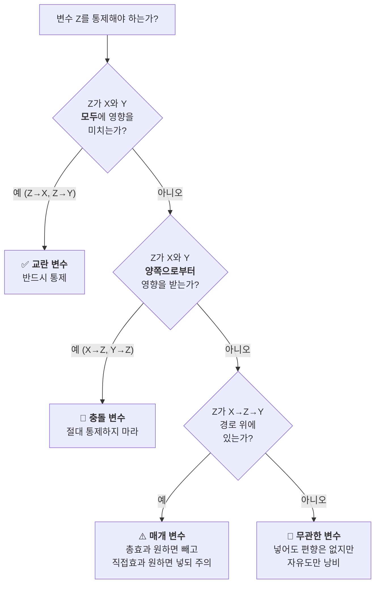
```mermaid
flowchart TD
    A["변수 Z를 통제해야 하는가?"] --> B{"Z가 X와 Y<br/><b>모두</b>에 영향을<br/>미치는가?"}
    B -->|"예 (Z→X, Z→Y)"| C["✅ <b>교란 변수</b><br/>반드시 통제"]
    B -->|아니오| D{"Z가 X와 Y<br/><b>양쪽으로부터</b><br/>영향을 받는가?"}
    D -->|"예 (X→Z, Y→Z)"| E["🚫 <b>충돌 변수</b><br/>절대 통제하지 마라"]
    D -->|아니오| F{"Z가 X→Z→Y<br/>경로 위에<br/>있는가?"}
    F -->|예| G["⚠️ <b>매개 변수</b><br/>총효과 원하면 빼고<br/>직접효과 원하면 넣되 주의"]
    F -->|아니오| H["🔹 <b>무관한 변수</b><br/>넣어도 편향은 없지만<br/>자유도만 낭비"]
```

### 실용적 원칙

1. <strong>통제변수를 넣기 전에 항상 물어라</strong>: "이 변수는 $X$에 영향을 미치는가, $Y$에 영향을 미치는가, 아니면 $X$의 결과인가?"
2. <strong>DAG(인과 다이어그램)을 그려라</strong>: 변수 간 화살표를 그려보면 어떤 변수를 통제해야 하는지가 보인다
3. <strong>"관련 있어 보이니까 넣었다"는 최악의 근거다</strong>: 이론적 정당화 없이 통제변수를 넣는 것은 오히려 해를 끼칠 수 있다
4. <strong>확실하지 않으면 넣지 마라</strong>: 교란 변수를 빠뜨리는 것(누락 변수 편향)도 문제지만, 잘못된 통제를 넣는 것(bad control)도 편향을 만든다. 확실한 교란 변수만 넣는 것이 안전하다

---

## 12. goodness-of-fit 관련 지표들은 왜 사회과학에서 중요하지 않은가?

### 먼저, goodness-of-fit이란?

Goodness-of-fit(적합도)이란 <strong>"우리가 세운 모형이 데이터를 얼마나 잘 설명하는가"</strong>를 측정하는 지표들의 총칭이다. 회귀분석 결과를 출력하면 계수 추정치 옆에 항상 따라오는 숫자들—$R^2$, Adjusted $R^2$, F-statistic, AIC, BIC 등—이 바로 이것이다.

학부 통계 수업에서는 이 지표들을 "모형이 좋은지 나쁜지 판단하는 기준"으로 강조하는 경우가 많다. 그러나 사회과학에서 이 지표들의 실질적 중요성은 교과서가 암시하는 것보다 훨씬 낮다. 왜 그런지 하나씩 살펴보자.

### $R^2$ (결정계수)

$$R^2 = 1 - \frac{\text{SSR}}{\text{SST}} = 1 - \frac{\sum_{i=1}^{n}(Y_i - \hat{Y}_i)^2}{\sum_{i=1}^{n}(Y_i - \bar{Y})^2}$$

수식을 풀어보면:

- <strong>SST</strong> (Total Sum of Squares) $= \sum(Y_i - \bar{Y})^2$: $Y$의 전체 변동. "각 관측치가 평균에서 얼마나 떨어져 있는가"의 총합
- <strong>SSR</strong> (Residual Sum of Squares) $= \sum(Y_i - \hat{Y}_i)^2$: 잔차의 제곱합. "모형이 설명하지 못한 변동"
- <strong>$R^2 = 1 - \frac{\text{SSR}}{\text{SST}}$</strong>: 전체 변동 중 모형이 설명하는 비율. 0이면 모형이 아무것도 설명 못함, 1이면 완벽히 설명

$R^2$는 "모형이 종속변수 분산의 몇 %를 설명하는가"를 나타낸다.

### $R^2$가 사회과학에서 중요하지 않은 이유

<strong>이유 1: 우리의 목표는 예측이 아니라 추정이다</strong>

앞서 논의했듯, 사회과학의 관심은 $\hat{\beta}_1$이지 $\hat{Y}_i$가 아니다. $R^2$가 0.05여도 $\hat{\beta}_1$이 편향 없이 추정되고 통계적으로 유의하면 충분히 의미 있는 발견이다.

예시를 들어보자. "성별이 부정선거론 수용에 미치는 효과"를 추정했는데 $R^2 = 0.03$이다. 이것은 "성별 하나로 부정선거론 수용의 3%만 설명할 수 있다"는 뜻이다. 당연히 낮다—사람의 정치적 태도는 수천 가지 요인에 의해 결정되니까. 그러나 $\hat{\beta}_1 = 9.8\%p$ (p < 0.01)이라면, "성별은 부정선거론 수용에 통계적으로 유의미한 영향을 미친다"는 결론은 완전히 유효하다.

<strong>이유 2: $R^2$는 변수를 추가하면 절대 줄지 않는다</strong>

$R^2$는 독립변수를 하나 추가하면 반드시 같거나 커진다—설령 그 변수가 완전히 무의미해도. 이 때문에 "설명력을 높이겠다"며 변수를 마구 추가하는 유혹에 빠지기 쉽다. 이것은 오히려 해로운데, 불필요한 통제변수를 넣으면 다중공선성이 생기거나, 나쁜 통제(bad control)가 되어 인과적 해석을 망칠 수 있다.

<strong>이유 3: 사회 현상은 본질적으로 $R^2$가 낮다</strong>

물리학에서 포물선 운동의 $R^2$는 0.99에 가깝다. 그런데 "왜 어떤 사람은 보수적이고 어떤 사람은 진보적인가"를 몇 개의 설문 문항으로 설명하려 하면 $R^2$는 0.1도 안 나오는 것이 정상이다. 인간 행동은 결정론적이지 않다. $R^2$가 낮다는 것은 모형이 나쁘다는 뜻이 아니라, <strong>현상 자체가 예측하기 어렵다</strong>는 뜻이다.

### VIF (Variance Inflation Factor, 분산팽창계수)

$$\text{VIF}_j = \frac{1}{1 - R_j^2}$$

여기서 $R_j^2$는 $X_j$를 나머지 모든 독립변수로 회귀했을 때의 $R^2$다. VIF가 높으면 "다중공선성(multicollinearity)이 심하다"고 한다.

### VIF가 사회과학에서 중요하지 않은 이유

<strong>다중공선성은 "문제"가 아니라 "데이터의 특성"이다.</strong>

다중공선성이 높으면:
- 계수의 표준오차가 커진다 → 유의하게 나오기 어렵다
- 그러나 <strong>계수 추정치 자체는 여전히 불편(unbiased)</strong>이다

즉, 다중공선성의 유일한 "문제"는 <strong>추정의 정밀도가 떨어진다</strong>는 것이다. 이것은 "표본이 더 필요하다"는 신호이지, "모형이 틀렸다"는 신호가 아니다.

VIF > 10이면 문제라는 "규칙"이 교과서에 있지만, 이 기준에 과학적 근거는 없다. 교차항이나 다항식 항(quadratic term)을 넣으면 VIF가 쉽게 10을 넘는데, 그렇다고 이 변수들을 빼야 하는 것은 아니다.

<strong>진짜 위험한 것</strong>: VIF가 높다는 이유로 이론적으로 중요한 통제변수를 빼버리면, 오히려 <strong>누락 변수 편향(omitted variable bias)</strong>이 발생한다. 다중공선성은 정밀도의 문제이고, 누락 변수는 편향의 문제다. 편향이 정밀도보다 훨씬 심각하다.

### VIF가 폭발할 때 진짜 의심해야 하는 것

VIF가 100, 1000 수준으로 극단적으로 높게 나오는 경우가 있다. 이때 교과서적 반응은 "다중공선성이 심하니 변수를 빼자"인데, 실제로는 <strong>변수를 빼고 넣고의 문제가 아니라 모형 자체가 잘못된 경우</strong>가 많다.

가장 흔한 원인: <strong>시계열 성격의 변수가 횡단면 모형에 들어가 있는 경우</strong>.

예를 들어, 연도별 패널 데이터에서 "연도(year)"와 "GDP"를 동시에 독립변수로 넣었다고 하자. GDP는 시간이 지나면 대체로 오르니까 연도와 거의 완벽하게 상관된다. 당연히 VIF가 폭발한다. 하지만 이 상황에서 해야 할 일은 "GDP를 빼자"나 "연도를 빼자"가 아니다. 둘 다 시간에 따라 추세(trend)를 타는 변수이므로, 애초에 횡단면 OLS가 아니라 <strong>시계열 모형이나 패널 모형(고정효과 등)</strong>을 써야 하는 상황이다.

더 일반적으로 말하면:

| VIF가 높은 상황 | 진짜 원인 | 해결법 |
|---|---|---|
| 교차항·다항식 넣었을 때 | 구조적으로 상관이 높을 수밖에 없음 | 무시해도 된다 (정상) |
| 시간 변수(연도, 분기 등)와 추세 변수(GDP, 인구 등) 동시 투입 | 두 변수가 모두 시간 추세를 공유 | 변수를 빼는 게 아니라 <strong>시계열·패널 모형으로 전환</strong> |
| 같은 개념을 다른 방식으로 측정한 변수 동시 투입 (예: 소득과 자산) | 거의 같은 것을 두 번 넣은 것 | 하나만 남기거나 합성 지표(index) 사용 |

핵심: VIF가 극단적으로 높으면 "어떤 변수를 빼야 하지?"가 아니라 <strong>"내가 지금 맞는 모형을 쓰고 있는 건가?"</strong>를 먼저 물어야 한다. 다중공선성은 종종 모형 specification 오류의 증상이지, 그 자체가 원인이 아니다.

### 요약

| 지표 | 보통 교과서가 말하는 것 | 사회과학에서의 실제 중요도 |
|------|------------------------|---------------------|
| $R^2$ | "높을수록 좋은 모형" | 관심 없다. 계수의 편향과 유의성이 중요 |
| Adjusted $R^2$ | "변수 추가의 패널티를 반영" | 역시 관심 없다. 모형 비교에도 잘 안 쓴다 |
| VIF | "10 넘으면 다중공선성 문제" | 대부분의 경우 무시해도 된다. 변수를 빼는 게 더 위험 |

---

## 13. 왜 '정규성 검정'은 중요하지 않은가?

### 흔한 오해: "잔차가 정규분포여야 회귀분석을 할 수 있다"

학부 통계 교과서에서 회귀분석의 가정을 배울 때, "오차항의 정규성"이 거의 반드시 등장한다. 그래서 많은 학생들이 분석 전에 Shapiro-Wilk 검정이나 Kolmogorov-Smirnov 검정을 돌려서 정규성을 확인하고, 기각되면 "이 데이터는 회귀분석을 쓸 수 없다"고 결론 내린다.

<strong>이것은 근본적으로 잘못된 관행이다.</strong>

### 이유 1: 정규성 가정은 소표본에서만 필요하다

OLS 추정치 $\hat{\beta}$의 분포가 정규분포라는 것은 두 가지 경로로 보장된다.

- <strong>경로 A — 정규성 성립</strong>: 오차항 $\epsilon_i$가 정규분포를 따른다 → $\hat{\beta}$는 <strong>정확히</strong> 정규분포. 이 경우 $t$-통계량은 <strong>정확히</strong> $t$-분포를, $F$-통계량은 <strong>정확히</strong> $F$-분포를 따른다. 소표본에서도 p-value가 정확하다
- <strong>경로 B — 정규성 불성립</strong>: 오차항이 무슨 분포든 상관없이, 표본이 충분히 크면 CLT에 의해 $\hat{\beta}$는 <strong>근사적으로</strong> 정규분포. 이 경우 $t$-통계량은 <strong>근사적으로</strong> $t$-분포(= 대표본에서는 표준정규분포)를, $F$-통계량은 <strong>근사적으로</strong> $F$-분포를 따른다

| | 오차 정규 (경로 A) | 오차 비정규 (경로 B) |
|--|--|--|
| $t$-통계량 | <strong>정확히</strong> $t$-분포 | 대표본에서 <strong>근사적으로</strong> $t$-분포 |
| $F$-통계량 | <strong>정확히</strong> $F$-분포 | 대표본에서 <strong>근사적으로</strong> $F$-분포 |
| p-value | 정확 | 근사적으로 정확 (n 클수록 정확해짐) |
| 필요 표본 크기 | 제한 없음 (n = 10이어도 OK) | $n$ > 수십~수백 필요 |

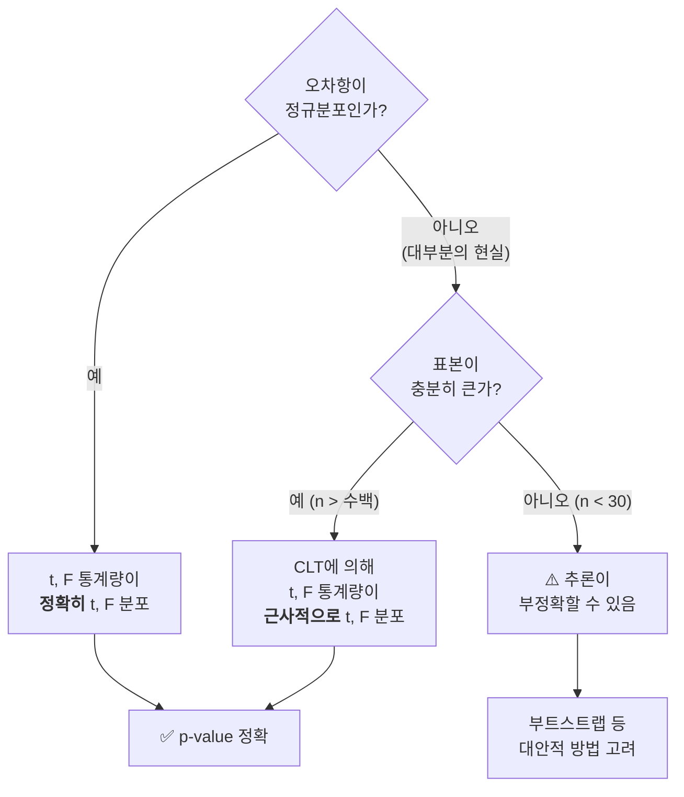
```mermaid
flowchart TD
    A{"오차항이<br/>정규분포인가?"} -->|예| B["t, F 통계량이<br/><b>정확히</b> t, F 분포"]
    A -->|"아니오<br/>(대부분의 현실)"| C{"표본이<br/>충분히 큰가?"}
    C -->|"예 (n > 수백)"| D["CLT에 의해<br/>t, F 통계량이<br/><b>근사적으로</b> t, F 분포"]
    C -->|"아니오 (n < 30)"| E["⚠️ 추론이<br/>부정확할 수 있음"]
    B --> F["✅ p-value 정확"]
    D --> F
    E --> G["부트스트랩 등<br/>대안적 방법 고려"]
```

요점: 정규성이 있으면 소표본에서도 정확한 추론이 가능하고, 없으면 CLT가 작동할 만큼 표본이 커야 한다. 사회과학 서베이 연구에서 표본 크기는 보통 수백~수천이다. 이 정도면 CLT가 충분히 작동하므로, 경로 B만으로도 충분하다. 정규성 가정이 실질적으로 필요한 것은 표본이 20~30 미만인 극소표본뿐이다.

### 이유 2: 정규성 검정은 표본이 클수록 무조건 기각된다

Shapiro-Wilk 검정의 귀무가설은 "이 데이터는 정규분포에서 왔다"이다. 현실 세계의 어떤 데이터도 <strong>완벽한</strong> 정규분포는 아니다—아무리 정규분포에 가까워도 미세한 차이는 존재한다.

표본이 크면 이 미세한 차이도 통계적으로 유의하게 잡힌다. 즉:

- n = 30: 정규성 검정 통과 (검정력 부족으로 차이를 못 잡음)
- n = 10,000: 정규성 검정 거의 100% 기각 (아무리 작은 차이도 잡음)

<strong>정규성 검정이 필요한 소표본에서는 검정력이 부족하고, 표본이 큰 경우에는 CLT 덕분에 검정이 불필요하다.</strong> 어느 쪽이든 정규성 검정은 쓸모가 없다.

### 이유 3: 중요한 가정은 다른 곳에 있다

OLS가 편향 없는 추정치를 주기 위해 정말로 필요한 가정은:

1. <strong>선형성</strong>: $Y$와 $X$의 관계가 (모수에 대해) 선형이다
2. <strong>외생성</strong>: $E[\epsilon_i | X_i] = 0$ — 오차항이 독립변수와 상관이 없다. <strong>이것이 가장 중요한 가정이다</strong>
3. <strong>무상관 오차</strong>: 관측치 간 오차가 독립이다 (시계열이 아닌 횡단면 데이터에서는 대체로 성립)

정규성은 이 목록에서 <strong>가장 중요하지 않은</strong> 가정이다. 외생성이 위반되면 (예: 누락 변수, 역인과, 선택 편향) $\hat{\beta}$가 편향되어 아무리 정규분포를 만족해도 소용없다. 반면 정규성이 위반되어도 위 1~3이 성립하면 CLT에 의해 추론은 유효하다.

### 이유 4: 검정해야 할 것은 "잔차"가 아니라 "추정치의 분포"

정규성을 검정하려면 개별 잔차 $\hat{\epsilon}_i$의 분포를 봐야 하는 게 아니라, $\hat{\beta}$의 <strong>표집 분포(sampling distribution)</strong>가 정규인지를 봐야 한다. 그런데 $\hat{\beta}$의 표집 분포는 데이터를 반복 추출해야 알 수 있는 것이므로, 한 번의 표본으로는 직접 검정할 수 없다. 우리가 할 수 있는 것은 CLT의 조건이 충족되는지 (충분한 표본 크기, 극단적 이상치 없음) 확인하는 것뿐이다.

### 그래서 어떻게 해야 하는가

1. <strong>정규성 검정은 하지 마라.</strong> Shapiro-Wilk도 K-S 검정도 돌리지 마라. 학부 과제가 아닌 이상 의미가 없다
2. <strong>잔차의 분포가 궁금하면 히스토그램을 그려보라.</strong> 검정 통계량보다 시각적 확인이 훨씬 유용하다. 극단적인 비대칭이나 이상치가 있는지만 보면 된다
3. <strong>표본이 충분히 크면 CLT를 믿어라.</strong> 사회과학 서베이에서 n > 100이면 대부분의 경우 충분하다
4. <strong>정규성보다 외생성을 걱정하라.</strong> "잔차가 정규분포인가"보다 "내가 빠뜨린 변수가 있지 않은가"가 100배 중요하다. 누락 변수 편향(omitted variable bias)이야말로 사회과학 통계의 진짜 적이다

### 서베이 예시

10대 청소년 정치성향 설문 데이터에서 잔차의 Shapiro-Wilk 검정 결과 p < 0.001로 "정규성 기각"이 나왔다고 하자. 이것은:

- 1,070명이나 되니까 당연히 기각된다 (위 이유 2)
- CLT에 의해 $\hat{\beta}$의 표집 분포는 이미 정규에 충분히 가깝다 (이유 1)
- 우리의 결론(성별 효과 = 9.8%p, p < 0.01)은 전혀 영향받지 않는다

<strong>진짜 걱정해야 할 것</strong>: "성별 외에 정치성향에 영향을 미치면서 동시에 성별과 상관 있는 변수를 빠뜨리지 않았는가?"—예를 들어, 남학생이 유독 특정 유형의 온라인 커뮤니티에 노출되고, 그 커뮤니티 노출이 부정선거론을 키우는 것이라면, 성별의 "효과"는 사실 커뮤니티 노출의 효과가 성별을 통해 나타난 것이다. 이것이 <strong>외생성 위반</strong>이고, 이 문제는 정규성 검정으로는 절대 잡히지 않는다.

---

## 14. 이분산성과 강건한 표준오차 (Robust Standard Errors)

### 이분산성(heteroskedasticity)이란

OLS의 가정 중 하나는 <strong>등분산(homoskedasticity)</strong>이다: 오차항의 분산이 $X$ 값에 상관없이 일정하다는 것.

$$\text{Var}(\epsilon_i | X_i) = \sigma^2 \quad \text{(모든 }i\text{에 대해 동일)}$$

이것이 깨지면 <strong>이분산(heteroskedasticity)</strong>이다: 오차의 분산이 $X$에 따라 달라진다.

$$\text{Var}(\epsilon_i | X_i) = \sigma_i^2 \quad \text{(}X_i\text{에 따라 다름)}$$

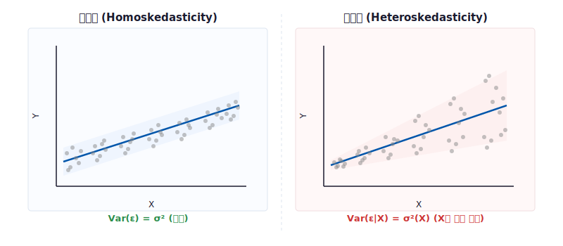

<strong>직관적으로</strong>: 등분산이면 회귀선 주위로 점들이 일정한 폭으로 퍼져 있다. 이분산이면 $X$가 커질수록 (또는 작아질수록) 점들이 더 넓게 퍼지는 "깔때기" 모양이 나타난다.

<strong>사회과학에서 이분산은 어디서 나타나는가?</strong>

- <strong>소득과 소비</strong>: 고소득자의 소비 패턴은 저소득자보다 훨씬 다양하다 (어떤 고소득자는 검소하고, 어떤 고소득자는 사치스럽다). 소득이 높을수록 소비의 분산이 커진다
- <strong>기업 규모와 수익성</strong>: 대기업은 수익 변동이 중소기업보다 다양할 수 있다
- <strong>교육과 임금</strong>: 고학력자 간의 임금 차이가 저학력자 간의 차이보다 크다

### 이분산이 있으면 뭐가 문제인가

<strong>좋은 소식</strong>: 이분산이 있어도 OLS 추정치 $\hat{\beta}$는 여전히 <strong>불편(unbiased)</strong>이다. 계수 추정 자체는 틀리지 않는다.

<strong>나쁜 소식</strong>: 표준오차($\text{SE}$)가 틀린다. OLS의 기본 표준오차 공식은 등분산을 가정하고 계산되므로, 이분산 하에서는 표준오차가 과소추정되거나 과대추정된다. 표준오차가 틀리면 → $t$-통계량이 틀리고 → <strong>p-value가 틀린다</strong> → 유의성 판단이 잘못된다.

| | 계수 추정치 ($\hat{\beta}$) | 표준오차 ($\text{SE}$) | p-value |
|--|--|--|--|
| <strong>등분산</strong> | 정확 | 정확 | 정확 |
| <strong>이분산 + 기본 SE</strong> | 정확 | <strong>틀림</strong> | <strong>틀림</strong> |
| <strong>이분산 + Robust SE</strong> | 정확 | 정확 | 정확 |

### 해결책: 강건한 표준오차 (Robust Standard Errors)

Huber(1967)와 White(1980)가 제안한 <strong>이분산-강건 표준오차(heteroskedasticity-robust standard errors, HC standard errors)</strong>는, 등분산 가정 없이도 올바른 표준오차를 계산하는 방법이다.

수학적으로: 기본 OLS의 분산 추정은 $\hat{\text{Var}}(\hat{\beta}) = s^2(X'X)^{-1}$인데, 이것은 $\text{Var}(\epsilon_i) = \sigma^2$ (등분산)을 가정한다. Robust 추정은 이 가정을 풀고, 각 관측치의 잔차 $\hat{\epsilon}_i^2$를 직접 사용한다:

$$\hat{\text{Var}}_{\text{robust}}(\hat{\beta}) = (X'X)^{-1} \left(\sum_{i=1}^{n} \hat{\epsilon}_i^2 x_i x_i'\right) (X'X)^{-1}$$

이것을 <strong>"샌드위치 추정량(sandwich estimator)"</strong>이라 부른다 — $(X'X)^{-1}$이 빵이고, 가운데 잔차 제곱 행렬이 속이다.

### Python에서의 사용법

```
import statsmodels.api as sm

# 기본 OLS (등분산 가정)
model = sm.OLS(Y, X).fit()

# Robust SE 적용
model_robust = sm.OLS(Y, X).fit(cov_type='HC3')
```

`HC3`는 가장 많이 쓰이는 옵션이다 (소표본에서도 성능이 좋다). 다른 옵션(`HC0`, `HC1`, `HC2`)도 있지만, 현대 통계학에서는 `HC3`가 기본 권장이다.

결과표에서 달라지는 것:

```
                 coef    std err          t      P>|t|      [0.025      0.975]
------------------------------------------------------------------------------
[기본 SE]
성별           9.800      3.100      3.161      0.002       3.717      15.883

[Robust SE (HC3)]
성별           9.800      3.540      2.768      0.006       2.855      16.745
```

- <strong>계수($\hat{\beta}$)는 동일하다</strong> — 9.800으로 변하지 않음
- <strong>표준오차가 달라진다</strong> — 3.100 → 3.540 (이 경우 이분산이 SE를 과소추정하고 있었음)
- <strong>p-value가 달라진다</strong> — 0.002 → 0.006 (여전히 유의하지만, 기본 SE보다 보수적)
- <strong>신뢰구간이 넓어진다</strong> — [3.7, 15.9] → [2.9, 16.7]

### "그냥 항상 Robust SE를 쓰면 되나?"

<strong>그렇다.</strong> 현대 사회과학 연구에서는 이것이 거의 합의된 관행이다.

- <strong>등분산이 성립할 때</strong>: Robust SE와 기본 SE가 거의 동일하다. Robust SE를 써도 손해가 없다
- <strong>이분산이 있을 때</strong>: Robust SE만 정확하다. 기본 SE는 틀린다
- <strong>따라서</strong>: 등분산 여부를 검정할 필요 없이, 처음부터 Robust SE를 쓰면 양쪽 모두 커버된다

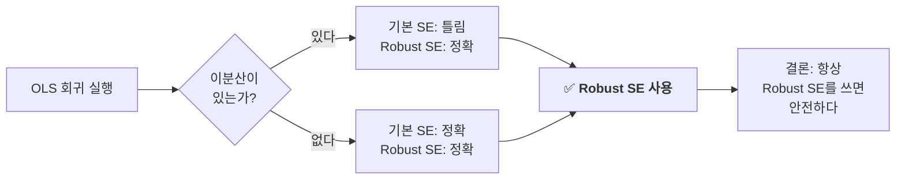
```mermaid
flowchart LR
    A["OLS 회귀 실행"] --> B{"이분산이<br/>있는가?"}
    B -->|"있다"| C["기본 SE: 틀림<br/>Robust SE: 정확"]
    B -->|"없다"| D["기본 SE: 정확<br/>Robust SE: 정확"]
    C --> E["✅ <b>Robust SE 사용</b>"]
    D --> E
    E --> F["결론: 항상<br/>Robust SE를 쓰면<br/>안전하다"]
```

<strong>주의사항</strong>: Robust SE는 <strong>횡단면(cross-section) 데이터</strong>에서의 이분산을 교정한다. 시계열 데이터에서 자기상관(autocorrelation)이 있거나, 클러스터(집단) 구조가 있으면 <strong>Newey-West SE</strong>나 <strong>Clustered SE</strong>가 필요하다. 이것은 후속 수업에서 다룬다.

### 이분산 검정은 해야 하는가?

정규성 검정과 마찬가지 논리가 적용된다: <strong>검정하지 않아도 된다.</strong>

- Breusch-Pagan 검정이나 White 검정으로 이분산을 검정할 수 있지만, 결과가 어떻든 결론은 "Robust SE를 쓴다"이므로 검정의 실익이 없다
- 굳이 검정하겠다면 잔차 vs. 적합값(fitted value) 산점도를 시각적으로 확인하는 것이 더 유용하다

### 서베이 예시

10대 청소년 정치성향 설문에서, 가구 소득이 높은 학생들일수록 정치 관심도의 분산이 커지는 패턴이 관찰된다고 하자 (부유한 가정의 자녀는 정치에 매우 관심 있는 경우와 전혀 무관심한 경우가 공존). 이때:

- 기본 SE로 분석하면 소득의 효과가 $p = 0.031$로 "간신히 유의"
- Robust SE로 분석하면 $p = 0.072$로 "유의하지 않음"

기본 SE가 이분산을 무시해서 표준오차를 과소추정한 결과, 실제로는 유의하지 않은 효과가 유의하게 나온 것이다. <strong>Robust SE를 쓰지 않았다면 잘못된 결론을 내릴 뻔했다.</strong>

이것이 "그냥 항상 Robust SE를 쓰라"는 조언의 근거다. 비용은 없고 보험 효과는 크다.

---

## 15. [맛보기] 선형대수로 이해하는 OLS — "회귀분석은 정사영이다"

### 이 챕터의 목적

지금까지 OLS를 미분으로 도출했다. $\frac{\partial S}{\partial \beta} = 0$으로 놓고, 식을 풀어서 $\hat{\beta}_1 = \frac{\text{Cov}(X,Y)}{\text{Var}(X)}$를 얻었다. 독립변수가 하나일 때는 이것으로 충분하다.

그런데 독립변수가 $k$개가 되면? 편미분을 $k+1$번 해야 하고, 연립방정식 $k+1$개를 풀어야 한다. 독립변수가 10개면 편미분 11번, 연립방정식 11개. 가능은 하지만 끔찍하다.

<strong>선형대수(행렬)를 쓰면 이 모든 것이 한 줄로 끝난다:</strong>

$$\hat{\boldsymbol{\beta}} = (\mathbf{X}'\mathbf{X})^{-1}\mathbf{X}'\mathbf{y}$$

하지만 이 공식이 진짜 강력한 이유는 단순히 "식이 짧아서"가 아니다. 행렬로 표현하면 OLS가 <strong>기하학적으로 무엇을 하는 것인지</strong>가 드러난다. 그것이 바로 <strong>정사영(orthogonal projection)</strong>이다.

이 챕터는 선형대수를 전혀 모르는 학생을 전제한다. 행렬 곱셈을 들어본 적은 있지만 제대로 배운 적은 없는 수준에서 출발한다.

---

### Step 0: 행렬과 벡터 — 딱 필요한 만큼만

#### 벡터: 숫자를 세로로 쌓은 것

<strong>벡터(vector)</strong>는 숫자를 세로로 나열한 것이다.

$$\mathbf{y} = \begin{pmatrix} y_1 \\ y_2 \\ \vdots \\ y_n \end{pmatrix}$$

$n$명의 응답자가 있으면, $\mathbf{y}$는 $n \times 1$ 벡터다. 각 원소 $y_i$는 $i$번째 사람의 종속변수 값이다.

<strong>기하학적 의미</strong>: $n$개의 숫자로 이루어진 벡터는 <strong>$n$차원 공간의 한 점(또는 원점에서 그 점으로 향하는 화살표)</strong>이다. 2차원 벡터 $(3,\ 4)^T$는 2차원 평면의 점 $(3, 4)$이자 원점에서 그 점으로 향하는 화살표다. 3차원 벡터는 3차원 공간의 화살표다. $n$차원 벡터는... 그림으로 그리기는 어렵지만 수학적으로는 정확히 같은 논리다.

#### 행렬: 벡터를 옆으로 나란히 놓은 것

<strong>행렬(matrix)</strong>은 숫자를 직사각형으로 배열한 것이다.

$$\mathbf{X} = \begin{pmatrix} 1 & X_{11} & X_{12} & \cdots & X_{1k} \\ 1 & X_{21} & X_{22} & \cdots & X_{2k} \\ \vdots & \vdots & \vdots & \ddots & \vdots \\ 1 & X_{n1} & X_{n2} & \cdots & X_{nk} \end{pmatrix}$$

- 행(row)은 가로줄: 각 행은 한 사람의 데이터
- 열(column)은 세로줄: 각 열은 하나의 변수
- 맨 왼쪽의 1로 이루어진 열은 <strong>절편(intercept)</strong>을 위한 열이다. 왜 1인가? $\beta_0 \times 1 = \beta_0$이 되게 하려고
- $\mathbf{X}$는 $n \times (k+1)$ 행렬이다 (응답자 $n$명, 절편 포함 변수 $k+1$개)

<strong>열 벡터로 보기</strong>: 행렬 $\mathbf{X}$를 "열(column)의 모음"으로 볼 수 있다.

$$\mathbf{X} = \begin{pmatrix} \mathbf{x}_0 & \mathbf{x}_1 & \mathbf{x}_2 & \cdots & \mathbf{x}_k \end{pmatrix}$$

여기서:

$$\mathbf{x}_0 = \begin{pmatrix} 1 \\ 1 \\ \vdots \\ 1 \end{pmatrix}, \quad \mathbf{x}_1 = \begin{pmatrix} X_{11} \\ X_{21} \\ \vdots \\ X_{n1} \end{pmatrix}, \quad \ldots

각 열 벡터 $\mathbf{x}_j$는 $n$차원 공간의 화살표 하나다. 이 "열 벡터"라는 개념이 이 챕터의 핵심이 된다.

#### 행렬 곱셈: 왜 이렇게 정의했는가

행렬 곱셈의 규칙은 처음 보면 이상하게 느껴진다. 왜 원소끼리 그냥 곱하지 않고, "행 × 열"로 복잡하게 정의했을까? 이유는 <strong>연립방정식을 한 번에 쓰기 위해서</strong>다.

연립방정식:

$$y_1 = \beta_0 + \beta_1 X_{11} + \beta_2 X_{12}$$
$$y_2 = \beta_0 + \beta_1 X_{21} + \beta_2 X_{22}$$
$$y_3 = \beta_0 + \beta_1 X_{31} + \beta_2 X_{32}$$

이것을 행렬로 쓰면:

$$\begin{pmatrix} y_1 \\ y_2 \\ y_3 \end{pmatrix} = \begin{pmatrix} 1 & X_{11} & X_{12} \\ 1 & X_{21} & X_{22} \\ 1 & X_{31} & X_{32} \end{pmatrix} \begin{pmatrix} \beta_0 \\ \beta_1 \\ \beta_2 \end{pmatrix}$$

$$\mathbf{y} = \mathbf{X}\boldsymbol{\beta}$$

$n$개의 식을 한 줄로 압축한 것이다. 행렬 곱셈의 "행 × 열" 규칙은 이 압축이 작동하도록 설계된 것이다.

#### 전치(transpose): 행과 열을 바꾸기

행렬 $\mathbf{X}$의 전치(transpose) $\mathbf{X}'$ (또는 $\mathbf{X}^T$)는 행과 열을 뒤집은 것이다.

$$\mathbf{X} = \begin{pmatrix} 1 & 3 \\ 1 & 5 \\ 1 & 7 \end{pmatrix} \quad \Rightarrow \quad \mathbf{X}' = \begin{pmatrix} 1 & 1 & 1 \\ 3 & 5 & 7 \end{pmatrix}$$

$n \times (k+1)$ 행렬의 전치는 $(k+1) \times n$ 행렬이 된다.

#### 내적(dot product): 두 벡터의 "닮은 정도"

두 벡터 $\mathbf{a}$, $\mathbf{b}$의 <strong>내적</strong>은:

$$\mathbf{a} \cdot \mathbf{b} = \mathbf{a}'\mathbf{b} = \sum_{i=1}^{n} a_i b_i$$

내적은 <strong>하나의 숫자</strong>를 반환한다. 기하학적으로 내적은 "두 벡터가 같은 방향을 가리키는 정도"를 측정한다.

- $\mathbf{a}'\mathbf{b} > 0$: 비슷한 방향
- $\mathbf{a}'\mathbf{b} = 0$: <strong>수직(직교, orthogonal)</strong> — 이 챕터에서 가장 중요한 경우
- $\mathbf{a}'\mathbf{b} < 0$: 반대 방향

<strong>내적이 0이면 두 벡터는 수직이다.</strong> 이 단순한 사실이 OLS의 기하학 전체를 지탱한다.

---

### Step 1: OLS 목적 함수를 행렬로 쓰기

섹션 1에서 도출한 OLS 목적 함수를 떠올려보자:

$$\min_{\boldsymbol{\beta}} \sum_{i=1}^{n} (y_i - \beta_0 - \beta_1 X_{i1} - \cdots - \beta_k X_{ik})^2$$

괄호 안의 $y_i - \beta_0 - \beta_1 X_{i1} - \cdots$는 $i$번째 잔차다. 이것을 벡터로 쓰면:

$$\mathbf{e} = \mathbf{y} - \mathbf{X}\boldsymbol{\beta}$$

잔차 제곱<strong>합</strong>은? 벡터의 각 원소를 제곱해서 더한 것이다. 이것은 벡터 자기 자신과의 내적이다:

$$\sum_{i=1}^{n} e_i^2 = \mathbf{e}'\mathbf{e} = (\mathbf{y} - \mathbf{X}\boldsymbol{\beta})'(\mathbf{y} - \mathbf{X}\boldsymbol{\beta})$$

따라서 OLS 목적 함수는:

$$\min_{\boldsymbol{\beta}}\ (\mathbf{y} - \mathbf{X}\boldsymbol{\beta})'(\mathbf{y} - \mathbf{X}\boldsymbol{\beta})$$

"잔차 벡터의 길이의 제곱을 최소화하라." 이것이 OLS의 행렬 표현이다.

---

### Step 2: 행렬 미분으로 정규방정식 도출

목적 함수를 전개하면:

$$S(\boldsymbol{\beta}) = \mathbf{y}'\mathbf{y} - 2\boldsymbol{\beta}'\mathbf{X}'\mathbf{y} + \boldsymbol{\beta}'\mathbf{X}'\mathbf{X}\boldsymbol{\beta}$$

이것을 $\boldsymbol{\beta}$에 대해 미분하고 0으로 놓으면 (행렬 미분의 자세한 규칙은 지금 몰라도 된다—결과만 보자):

$$\frac{\partial S}{\partial \boldsymbol{\beta}} = -2\mathbf{X}'\mathbf{y} + 2\mathbf{X}'\mathbf{X}\boldsymbol{\beta} = \mathbf{0}$$

정리하면:

$$\boxed{\mathbf{X}'\mathbf{X}\hat{\boldsymbol{\beta}} = \mathbf{X}'\mathbf{y}} \quad \text{— 정규방정식 (Normal Equation)}$$

$\mathbf{X}'\mathbf{X}$의 역행렬이 존재하면 (= 완전 다중공선성이 없으면, 섹션 2 참고):

$$\boxed{\hat{\boldsymbol{\beta}} = (\mathbf{X}'\mathbf{X})^{-1}\mathbf{X}'\mathbf{y}}$$

<strong>이것이 OLS 공식이다.</strong> 독립변수가 1개든 100개든, 이 한 줄이 전부다.

---

### Step 3: 정규방정식의 놀라운 의미 — "잔차는 $\mathbf{X}$에 수직이다"

정규방정식 $\mathbf{X}'\mathbf{X}\hat{\boldsymbol{\beta}} = \mathbf{X}'\mathbf{y}$를 다시 쓰면:

$$\mathbf{X}'\mathbf{y} = \mathbf{X}'\mathbf{X}\hat{\boldsymbol{\beta}}$$

$$\mathbf{X}'\mathbf{y} - \mathbf{X}'\mathbf{X}\hat{\boldsymbol{\beta}} = \mathbf{0}$$

$$\mathbf{X}'(\mathbf{y} - \mathbf{X}\hat{\boldsymbol{\beta}}) = \mathbf{0}$$

$\mathbf{y} - \mathbf{X}\hat{\boldsymbol{\beta}} = \hat{\mathbf{e}}$ (잔차 벡터)이므로:

$$\boxed{\mathbf{X}'\hat{\mathbf{e}} = \mathbf{0}}$$

이 식이 말하는 것: <strong>$\mathbf{X}$의 모든 열 벡터와 잔차 벡터의 내적이 0이다.</strong>

내적이 0이라는 것은? 수직(직교, orthogonal)이라는 뜻이다!

$\mathbf{X}$에 열이 $k+1$개 있으므로, 이것을 열별로 풀어 쓰면:

$$\mathbf{x}_0'\hat{\mathbf{e}} = 0 \quad \text{(절편 열과 잔차가 수직 → 잔차의 합 = 0)}$$
$$\mathbf{x}_1'\hat{\mathbf{e}} = 0 \quad \text{(첫 번째 독립변수와 잔차가 수직)}$$
$$\vdots$$
$$\mathbf{x}_k'\hat{\mathbf{e}} = 0 \quad \text{($k$번째 독립변수와 잔차가 수직)}$$

<strong>OLS 잔차는 모든 독립변수에 대해 수직이다.</strong> 이것은 단순한 수학적 성질이 아니라, OLS가 <strong>기하학적으로 무엇을 하고 있는지</strong>를 드러낸다.

---

### Step 4: "정사영"이란 무엇인가 — 그림자 비유

"수직"이라는 개념이 나왔으니, 이제 <strong>정사영(orthogonal projection)</strong>을 설명할 수 있다.

태양이 바로 위에서 비추면, 3차원 물체의 그림자가 바닥(2차원 평면)에 생긴다. 이 그림자가 바로 "정사영"이다.

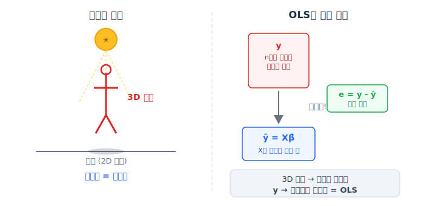

정사영의 핵심 성질:

- 그림자는 바닥(부분공간) <strong>위에</strong> 있다
- 물체에서 그림자까지의 거리(= 빛줄기)는 바닥에 <strong>수직</strong>이다
- 그림자는 바닥 위에서 물체에 <strong>가장 가까운 점</strong>이다

2차원에서 더 명확하게 보자. 벡터 $\mathbf{y}$를 직선(1차원 부분공간) 위에 정사영하면:

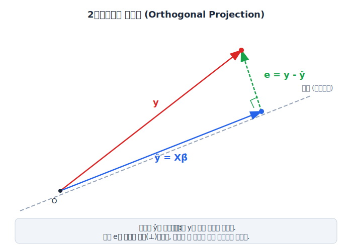

- <strong>$\mathbf{y}$</strong> (빨간색): 원래 벡터
- <strong>$\hat{\mathbf{y}}$</strong> (파란색): 직선 위에 내려찍힌 점 = 정사영
- <strong>$\mathbf{e}$</strong> (초록색): $\mathbf{y}$에서 $\hat{\mathbf{y}}$까지의 차이 = 잔차

핵심: <strong>$\hat{\mathbf{y}}$는 직선 위에서 $\mathbf{y}$에 가장 가까운 점이다. 왜? 잔차 $\mathbf{e}$가 직선에 수직이기 때문이다.</strong>

왜 수직일 때 가장 가까운가? 피타고라스 정리 때문이다. 직선 위의 아무 다른 점 $\mathbf{z}$를 잡으면:

$$\|\mathbf{y} - \mathbf{z}\|^2 = \|\mathbf{y} - \hat{\mathbf{y}}\|^2 + \|\hat{\mathbf{y}} - \mathbf{z}\|^2 \geq \|\mathbf{y} - \hat{\mathbf{y}}\|^2$$

직각삼각형의 빗변은 항상 다른 변보다 길다. 따라서 수직으로 내려찍은 점이 언제나 가장 가깝다.

---

### Step 5: OLS는 $\mathbf{y}$를 $\mathbf{X}$의 열공간에 정사영하는 것이다

이제 모든 조각을 맞출 수 있다.

#### 열공간(Column Space)이란

$\mathbf{X}$의 열공간 $\text{Col}(\mathbf{X})$란, $\mathbf{X}$의 열 벡터들을 <strong>임의의 비율로 섞어서</strong> 만들 수 있는 모든 벡터의 집합이다.

$$\text{Col}(\mathbf{X}) = \{\mathbf{X}\boldsymbol{\beta} : \boldsymbol{\beta} \in \mathbb{R}^{k+1}\}$$

풀어서 쓰면:

$$\mathbf{X}\boldsymbol{\beta} = \beta_0 \mathbf{x}_0 + \beta_1 \mathbf{x}_1 + \cdots + \beta_k \mathbf{x}_k$$

열 벡터들을 $\beta_0, \beta_1, \ldots, \beta_k$라는 가중치로 섞은 것이다. 이 "섞는 비율"을 바꾸면 열공간 안에서 다른 점이 된다. 열공간은 $n$차원 공간 안에 있는 $(k+1)$차원의 "평면"이라고 생각하면 된다.

<strong>중요한 관찰</strong>: 회귀분석의 예측값 $\hat{\mathbf{y}} = \mathbf{X}\hat{\boldsymbol{\beta}}$는 $\mathbf{X}$의 열공간 안에 있다. $\hat{\boldsymbol{\beta}}$라는 특정 가중치로 열 벡터들을 섞은 결과니까.

#### 모든 것이 연결된다

| OLS의 대수적 표현 | 기하학적 의미 |
|---|---|
| $\hat{\mathbf{y}} = \mathbf{X}\hat{\boldsymbol{\beta}}$ | $\mathbf{y}$를 $\text{Col}(\mathbf{X})$에 정사영한 점 |
| $\hat{\mathbf{e}} = \mathbf{y} - \hat{\mathbf{y}}$ | $\mathbf{y}$에서 정사영까지의 수직 거리 |
| $\mathbf{X}'\hat{\mathbf{e}} = \mathbf{0}$ | 잔차가 열공간에 <strong>수직</strong>이다 |
| $\min \|\mathbf{e}\|^2$ | 수직 거리가 <strong>가장 짧다</strong> |

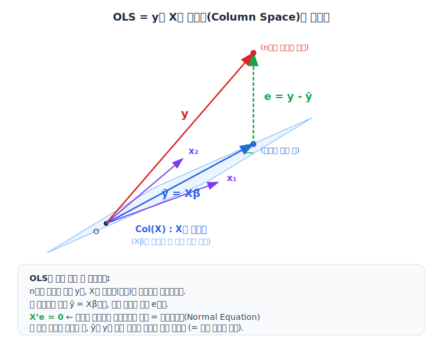

<strong>OLS가 하는 일을 한 문장으로</strong>: $n$차원 공간에 있는 관측값 벡터 $\mathbf{y}$를, $\mathbf{X}$의 열공간이라는 "평면"에 수직으로 내려찍는다. 내려찍힌 점이 $\hat{\mathbf{y}}$이고, 수직 거리가 잔차 $\hat{\mathbf{e}}$이다. 수직으로 내려찍었기 때문에, 이 점은 열공간 위에서 $\mathbf{y}$에 가장 가까운 점이다—즉, 잔차 제곱합이 최소다.

<strong>정규방정식 $\mathbf{X}'\hat{\mathbf{e}} = \mathbf{0}$은 "잔차가 열공간에 수직"이라는 기하학적 조건을 대수적으로 표현한 것에 불과하다.</strong>

---

### Step 6: 구체적 예시 — 3명, 변수 1개

숫자로 직접 확인해보자. 학생 3명의 데이터:

| 학생 | $X$ (공부 시간) | $Y$ (시험 점수) |
|------|--------|--------|
| A | 1 | 2 |
| B | 2 | 3 |
| C | 3 | 7 |

행렬로:

$$\mathbf{X} = \begin{pmatrix} 1 & 1 \\ 1 & 2 \\ 1 & 3 \end{pmatrix}, \quad \mathbf{y} = \begin{pmatrix} 2 \\ 3 \\ 7 \end{pmatrix}$$

<strong>(1) $\mathbf{X}'\mathbf{X}$ 계산</strong>:

$$\mathbf{X}'\mathbf{X} = \begin{pmatrix} 1 & 1 & 1 \\ 1 & 2 & 3 \end{pmatrix} \begin{pmatrix} 1 & 1 \\ 1 & 2 \\ 1 & 3 \end{pmatrix} = \begin{pmatrix} 3 & 6 \\ 6 & 14 \end{pmatrix}$$

<strong>(2) $\mathbf{X}'\mathbf{y}$ 계산</strong>:

$$\mathbf{X}'\mathbf{y} = \begin{pmatrix} 1 & 1 & 1 \\ 1 & 2 & 3 \end{pmatrix} \begin{pmatrix} 2 \\ 3 \\ 7 \end{pmatrix} = \begin{pmatrix} 12 \\ 29 \end{pmatrix}$$

<strong>(3) $(\mathbf{X}'\mathbf{X})^{-1}$ 계산</strong>:

$2 \times 2$ 행렬의 역행렬 공식:

$$\begin{pmatrix} a & b \\ c & d \end{pmatrix}^{-1} = \frac{1}{ad-bc}\begin{pmatrix} d & -b \\ -c & a \end{pmatrix}$$

$$(\mathbf{X}'\mathbf{X})^{-1} = \frac{1}{3 \times 14 - 6 \times 6}\begin{pmatrix} 14 & -6 \\ -6 & 3 \end{pmatrix} = \frac{1}{6}\begin{pmatrix} 14 & -6 \\ -6 & 3 \end{pmatrix}$$

<strong>(4) $\hat{\boldsymbol{\beta}} = (\mathbf{X}'\mathbf{X})^{-1}\mathbf{X}'\mathbf{y}$</strong>:

$$\hat{\boldsymbol{\beta}} = \frac{1}{6}\begin{pmatrix} 14 & -6 \\ -6 & 3 \end{pmatrix}\begin{pmatrix} 12 \\ 29 \end{pmatrix} = \frac{1}{6}\begin{pmatrix} 168 - 174 \\ -72 + 87 \end{pmatrix} = \frac{1}{6}\begin{pmatrix} -6 \\ 15 \end{pmatrix} = \begin{pmatrix} -1 \\ 2.5 \end{pmatrix}$$

따라서 $\hat{\beta}_0 = -1$, $\hat{\beta}_1 = 2.5$. 회귀식: $\hat{Y} = -1 + 2.5X$.

<strong>(5) 정사영 확인</strong>:

$$\hat{\mathbf{y}} = \mathbf{X}\hat{\boldsymbol{\beta}} = \begin{pmatrix} 1 & 1 \\ 1 & 2 \\ 1 & 3 \end{pmatrix}\begin{pmatrix} -1 \\ 2.5 \end{pmatrix} = \begin{pmatrix} 1.5 \\ 4.0 \\ 6.5 \end{pmatrix}$$

$$\hat{\mathbf{e}} = \mathbf{y} - \hat{\mathbf{y}} = \begin{pmatrix} 2 \\ 3 \\ 7 \end{pmatrix} - \begin{pmatrix} 1.5 \\ 4.0 \\ 6.5 \end{pmatrix} = \begin{pmatrix} 0.5 \\ -1.0 \\ 0.5 \end{pmatrix}$$

<strong>(6) 수직 조건 검증 — $\mathbf{X}'\hat{\mathbf{e}} = \mathbf{0}$인가?</strong>

$$\mathbf{X}'\hat{\mathbf{e}} = \begin{pmatrix} 1 & 1 & 1 \\ 1 & 2 & 3 \end{pmatrix}\begin{pmatrix} 0.5 \\ -1.0 \\ 0.5 \end{pmatrix} = \begin{pmatrix} 0.5 - 1.0 + 0.5 \\ 0.5 - 2.0 + 1.5 \end{pmatrix} = \begin{pmatrix} 0 \\ 0 \end{pmatrix}\ ✓$$

<strong>잔차가 $\mathbf{X}$의 두 열 벡터 모두에 대해 정확히 수직이다.</strong>

첫 번째 행 $\mathbf{x}_0'\hat{\mathbf{e}} = 0$은 "잔차의 합이 0"이라는 뜻이고 (OLS의 잘 알려진 성질), 두 번째 행 $\mathbf{x}_1'\hat{\mathbf{e}} = 0$은 "독립변수와 잔차의 공분산이 0"이라는 뜻이다. 이 두 성질이 정사영의 수직 조건에서 자동으로 나온다.

---

### Step 7: Hat Matrix — "예측값을 만드는 기계"

OLS 공식을 한 번 더 보자:

$$\hat{\mathbf{y}} = \mathbf{X}\hat{\boldsymbol{\beta}} = \mathbf{X}(\mathbf{X}'\mathbf{X})^{-1}\mathbf{X}'\mathbf{y}$$

여기서 $\mathbf{y}$ 앞에 붙은 부분을 따로 떼면:

$$\mathbf{H} = \mathbf{X}(\mathbf{X}'\mathbf{X})^{-1}\mathbf{X}'$$

$$\hat{\mathbf{y}} = \mathbf{H}\mathbf{y}$$

$\mathbf{H}$는 <strong>$\mathbf{y}$에 "hat(^)"을 씌워서 $\hat{\mathbf{y}}$로 만드는 행렬</strong>이라서 <strong>hat matrix</strong>라 부른다.

$\mathbf{H}$의 성질:

| 성질 | 의미 |
|------|------|
| $\mathbf{H}\mathbf{y} = \hat{\mathbf{y}}$ | $\mathbf{y}$를 열공간에 정사영한다 |
| $\mathbf{H}^2 = \mathbf{H}$ (멱등, idempotent) | 이미 열공간 위에 있는 벡터를 다시 정사영하면 제자리다 (그림자의 그림자 = 그림자) |
| $\mathbf{H}' = \mathbf{H}$ (대칭) | 정사영 행렬은 항상 대칭이다 |

$\mathbf{H}^2 = \mathbf{H}$가 직관적으로 말하는 것: <strong>바닥에 떨어진 그림자를 다시 정사영하면 이미 바닥에 있으니까 그대로다.</strong> $\hat{\mathbf{y}}$는 이미 열공간 위에 있으므로 다시 정사영해도 움직이지 않는다.

마찬가지로 잔차를 만드는 행렬도 정의할 수 있다:

$$\mathbf{M} = \mathbf{I} - \mathbf{H}$$

$$\hat{\mathbf{e}} = \mathbf{M}\mathbf{y} = (\mathbf{I} - \mathbf{H})\mathbf{y} = \mathbf{y} - \hat{\mathbf{y}}$$

$\mathbf{M}$도 멱등이고 대칭이다. $\mathbf{H}$가 "열공간 위로 내려찍기"라면, $\mathbf{M}$은 "열공간에 수직인 방향 성분만 남기기"다.

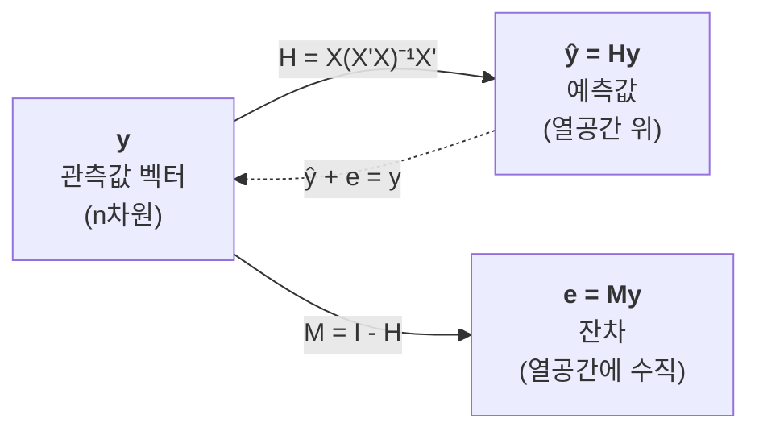
```mermaid
flowchart LR
    Y["<b>y</b><br/>관측값 벡터<br/>(n차원)"] -->|"H = X(X'X)⁻¹X'"| YHAT["<b>ŷ = Hy</b><br/>예측값<br/>(열공간 위)"]
    Y -->|"M = I - H"| E["<b>e = My</b><br/>잔차<br/>(열공간에 수직)"]
    YHAT -.->|"ŷ + e = y"| Y
```

---

### 미분 도출 vs. 정사영: 같은 것을 두 가지 언어로

| | 미분으로 도출 (섹션 1) | 선형대수로 도출 (이 챕터) |
|--|--|--|
| <strong>출발점</strong> | $\min \sum e_i^2$를 편미분 | $\min \|\mathbf{e}\|^2$를 행렬 미분 |
| <strong>핵심 조건</strong> | $\frac{\partial S}{\partial \beta_j} = 0$ (각 계수에 대해) | $\mathbf{X}'\hat{\mathbf{e}} = \mathbf{0}$ (한 번에) |
| <strong>해</strong> | $\hat{\beta}_1 = \frac{\text{Cov}(X,Y)}{\text{Var}(X)}$ (변수 1개일 때) | $\hat{\boldsymbol{\beta}} = (\mathbf{X}'\mathbf{X})^{-1}\mathbf{X}'\mathbf{y}$ (변수 $k$개에도 동일) |
| <strong>기하학적 해석</strong> | 명시적이지 않음 | $\mathbf{y}$를 열공간에 수직으로 내려찍기 |
| <strong>스케일링</strong> | 변수 늘어나면 식이 폭발 | 변수 수에 무관하게 동일한 형태 |

<strong>두 접근은 정확히 같은 답을 준다.</strong> 미분 접근에서 나오는 $k+1$개의 1차 조건은 정규방정식 $\mathbf{X}'\hat{\mathbf{e}} = \mathbf{0}$의 각 행이다. 단지 표현 언어가 다를 뿐, 같은 최적화 문제를 풀고 있다.

---

### 왜 이 관점이 중요한가: 세 가지 통찰

<strong>통찰 1 — 완전 다중공선성의 기하학적 이해</strong>

섹션 2에서 더미 변수를 전부 넣으면 "$(X'X)$가 singular가 되어 역행렬이 존재하지 않는다"고 했다. 기하학적으로 이것은: <strong>열 벡터들이 서로 겹쳐서 열공간이 "납작해진" 것</strong>이다. 열 벡터 하나가 나머지의 선형결합이면, 그 벡터를 추가해도 열공간의 차원이 늘어나지 않는다. 납작한 평면 위에서는 정사영이 유일하지 않다—같은 방향으로 내려찍는 점이 무한히 많아진다.

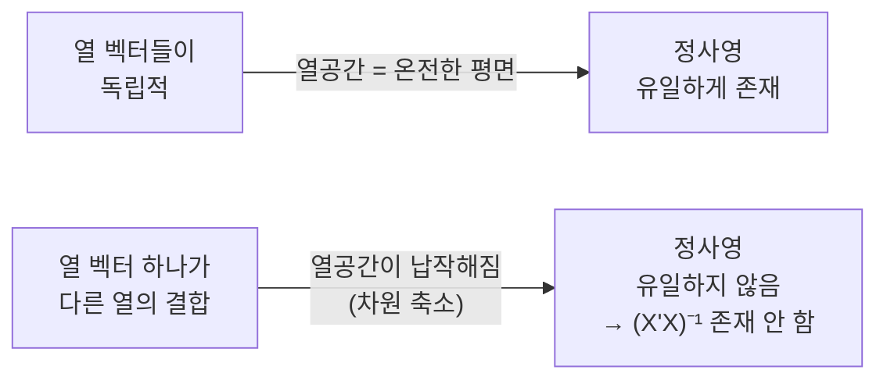
```mermaid
flowchart LR
    A["열 벡터들이<br/>독립적"] -->|"열공간 = 온전한 평면"| B["정사영<br/>유일하게 존재"]
    C["열 벡터 하나가<br/>다른 열의 결합"] -->|"열공간이 납작해짐<br/>(차원 축소)"| D["정사영<br/>유일하지 않음<br/>→ (X'X)⁻¹ 존재 안 함"]
```

<strong>통찰 2 — $R^2$의 기하학적 의미</strong>

결정계수 $R^2$은 "설명된 분산의 비율"이라고 배웠다. 기하학적으로:

$$R^2 = \frac{\|\hat{\mathbf{y}} - \bar{y}\mathbf{1}\|^2}{\|\mathbf{y} - \bar{y}\mathbf{1}\|^2} = \cos^2\theta$$

여기서 $\theta$는 $\mathbf{y} - \bar{y}\mathbf{1}$과 $\hat{\mathbf{y}} - \bar{y}\mathbf{1}$ 사이의 각도다.

- $R^2 = 1$: $\theta = 0°$. $\mathbf{y}$가 열공간 안에 완전히 들어와 있다. 정사영해도 움직이지 않는다 (= 잔차 없음)
- $R^2 = 0$: $\theta = 90°$. $\mathbf{y}$가 열공간에 완전히 수직이다. 정사영하면 $\bar{y}\mathbf{1}$만 남는다 (= 평균만 설명)
- $0 < R^2 < 1$: 중간 각도. $\mathbf{y}$의 일부만 열공간이 설명한다

<strong>통찰 3 — 통제변수의 기하학</strong>

섹션 3에서 통제변수를 넣으면 "같은 조건의 사람들끼리 비교한다"고 했다. 기하학적으로: 통제변수를 넣는다는 것은 <strong>열공간을 더 넓히는 것</strong>이다. 열공간이 넓어지면 $\mathbf{y}$에 더 가까이 정사영할 수 있으므로, 잔차가 줄어들고 $R^2$가 올라간다. 하지만 핵심은 $R^2$가 아니라, 관심 변수의 계수 $\hat{\beta}_1$이 편향 없이 추정되는지 여부다—열공간의 "방향"이 바뀌면 정사영의 결과도 달라지기 때문이다.

---

### 정리: 5줄로 요약하는 OLS의 기하학

| 줄 | 사실 |
|----|------|
| 1 | 데이터 $\mathbf{y}$는 $n$차원 공간의 벡터다 |
| 2 | $\mathbf{X}$의 열 벡터들이 만드는 부분공간이 <strong>열공간</strong>이다 |
| 3 | OLS는 $\mathbf{y}$를 이 열공간에 <strong>수직으로 내려찍는다</strong> (정사영) |
| 4 | 내려찍힌 점이 $\hat{\mathbf{y}}$, 수직 거리가 잔차 $\hat{\mathbf{e}}$다 |
| 5 | 수직이므로 최단 거리 → <strong>잔차 제곱합이 최소</strong> → 이것이 OLS다 |

결국, <strong>"잔차 제곱합을 최소화하라"는 최적화 문제</strong>와 <strong>"$\mathbf{y}$를 열공간에 수직으로 내려찍어라"는 기하학적 연산</strong>은 정확히 같은 것이다. 미분으로 풀면 전자가 보이고, 선형대수로 풀면 후자가 보인다. 두 관점 모두 OLS를 이해하는 데 필수적이다.
